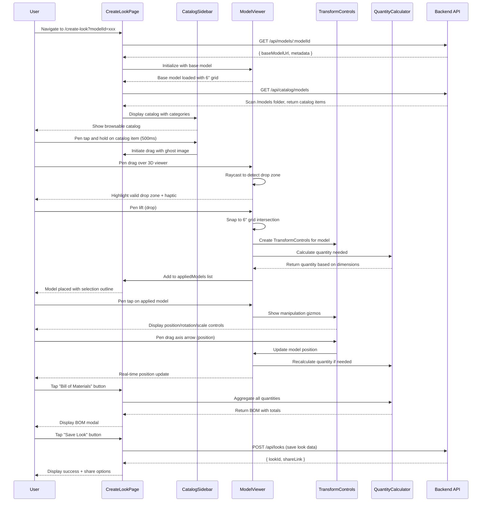

# Design Document: Create Look Feature

## Overview

The Create Look feature is a 3D model composition page where users apply decorative catalog models (panels, lights, cove, bidding, etc.) onto their generated base wall model using pen/tablet input. This feature transforms the static 3D wall viewer into an interactive design workspace, enabling users to visualize, manipulate, and quantify decorative elements in real-time.

The feature builds on the existing Blender Viewer implementation, reusing the ModelViewer component for 3D rendering while adding catalog browsing, drag-and-drop placement, model manipulation with Three.js TransformControls, quantity calculation based on 6-inch grid alignment, and Bill of Materials generation. All interactions are optimized for pen/tablet input with 44x44px minimum touch targets, pressure sensitivity support, and haptic feedback.

Key capabilities include: scanning `/models` folder for catalog items, parsing filename metadata (`{MODEL_ID}_{WIDTH}X{HEIGHT}X{DEPTH}_FT.glb`), drag-and-drop with pen optimization, Three.js-based model manipulation (position, rotation, scale), automatic quantity calculation using marked dimensions and 6-inch grid, BOM generation and export, and look persistence (save/load/share).

## Main Algorithm/Workflow




## Architecture

### System Architecture

```mermaid
graph TD
    A[User Browser - Pen/Tablet] -->|HTTP Request| B[Frontend React App]
    B -->|API Call| C[Backend Express Server]
    C -->|Query| D[Database - Looks & Metadata]
    C -->|Scan| E[/models Folder - Catalog GLB Files]
    C -->|Fetch| F[GCP Cloud Storage - Base Model]
    F -->|Signed URL| C
    C -->|Base Model + Catalog| B
    
    B -->|Load Base Model| G[Three.js Scene]
    B -->|Load Catalog Models| G
    G -->|Render| H[WebGL Canvas]
    H -->|Display| A
    
    B -->|Pen Input| I[Drag & Drop Handler]
    I -->|Raycast| G
    
    B -->|Manipulation| J[TransformControls]
    J -->|Update Position/Rotation/Scale| G
    
    B -->|Calculate| K[Quantity Calculator]
    K -->|Based on Grid & Dimensions| L[6-inch Grid System]
    
    B -->|Generate| M[BOM Generator]
    M -->|Aggregate Quantities| K
    
    B -->|Save/Load| C
    C -->|Store| D
    
    style B fill:#e1f5ff
    style C fill:#fff4e1
    style G fill:#e8f5e9
    style H fill:#fce4ec
    style E fill:#fff9c4
```

### Component Architecture

```mermaid
graph TD
    A[CreateLookPage] --> B[ModelViewer - Reused from Blender Viewer]
    A --> C[CatalogSidebar]
    A --> D[ViewerControls]
    A --> E[PropertiesPanel]
    A --> F[BOMModal]
    A --> G[SaveLookModal]
    A --> H[LoadingIndicator]
    A --> I[ErrorDisplay]
    A --> J[GlobalHeader]
    
    B --> K[Three.js Scene]
    B --> L[GLTFLoader]
    B --> M[OrbitControls]
    B --> N[TransformControls - NEW]
    B --> O[GridHelper - 6 inch]
    B --> P[Raycaster - Drop Detection]
    
    C --> Q[CategoryFilter]
    C --> R[SearchBar]
    C --> S[CatalogItemCard]
    C --> T[DragGhostImage]
    
    D --> U[ZoomControls]
    D --> V[ViewModeSelector]
    D --> W[GridToggle]
    D --> X[SnapToggle - NEW]
    D --> Y[ResetViewButton]
    
    E --> Z[PositionInputs]
    E --> AA[RotationInputs]
    E --> AB[ScaleInputs]
    E --> AC[QuantityDisplay]
    E --> AD[ContextMenu]
    
    F --> AE[BOMTable]
    F --> AF[ExportButtons]
    
    K --> AG[Camera]
    K --> AH[Lights]
    K --> AI[Base Model Mesh]
    K --> AJ[Applied Models Array]
    K --> AK[Grid Overlay]
    
    style A fill:#e3f2fd
    style B fill:#f3e5f5
    style C fill:#e8f5e9
    style N fill:#ffebee
    style P fill:#ffebee
```




### Data Flow Architecture

```mermaid
graph LR
    A[/models Folder] -->|Scan & Parse| B[Catalog Service]
    B -->|Return Catalog Items| C[CatalogSidebar]
    C -->|User Selects| D[Drag Handler]
    D -->|Drop Event| E[Raycaster]
    E -->|Valid Drop Zone| F[Model Placer]
    F -->|Add to Scene| G[Three.js Scene]
    F -->|Calculate Quantity| H[Quantity Calculator]
    H -->|Store Quantity| I[Applied Models State]
    I -->|User Manipulates| J[TransformControls]
    J -->|Update Position/Rotation/Scale| G
    J -->|Recalculate| H
    I -->|Generate BOM| K[BOM Generator]
    K -->|Display| L[BOM Modal]
    I -->|Save Look| M[Backend API]
    M -->|Store| N[Database]
    
    style A fill:#fff9c4
    style G fill:#e8f5e9
    style H fill:#ffebee
    style I fill:#e1f5ff
```

## Components and Interfaces

### Component 1: CreateLookPage

**Purpose**: Main orchestrator component that manages the entire Create Look workflow, coordinating between catalog, viewer, and manipulation systems.

**Interface**:
```typescript
interface ICreateLookPageProps {
  baseModelId: string;
}

interface ICreateLookPageState {
  baseModelUrl: string | null;
  baseModelMetadata: IModelMetadata | null;
  catalogItems: ICatalogItem[];
  appliedModels: IAppliedModel[];
  selectedModelId: string | null;
  isLoading: boolean;
  loadingProgress: number;
  loadingStage: string;
  error: string | null;
  showGrid: boolean;
  snapToGrid: boolean;
  viewMode: ViewMode;
  showBOM: boolean;
  showSaveModal: boolean;
  isDragging: boolean;
  draggedItem: ICatalogItem | null;
}

type ViewMode = 'perspective' | 'orthographic' | 'wireframe';
```

**Responsibilities**:
- Fetch base model URL and metadata from backend
- Load catalog items from `/models` folder via API
- Manage applied models state (add, update, remove)
- Handle drag-and-drop workflow coordination
- Manage selection state for model manipulation
- Coordinate quantity calculations
- Generate and display Bill of Materials
- Handle save/load/share functionality
- Manage global UI state (modals, loading, errors)


### Component 2: CatalogSidebar

**Purpose**: Displays browsable catalog of decorative models with category filtering, search, and drag initiation for pen/tablet input.

**Interface**:
```typescript
interface ICatalogSidebarProps {
  catalogItems: ICatalogItem[];
  isCollapsed: boolean;
  onToggleCollapse: () => void;
  onDragStart: (item: ICatalogItem, event: PointerEvent) => void;
  onItemSelect: (item: ICatalogItem) => void;
}

interface ICatalogItem {
  id: string; // Extracted from filename (e.g., "WX919")
  name: string;
  description: string;
  category: CatalogCategory;
  dimensions: { width: number; height: number; depth: number }; // In feet
  unitCost?: number;
  thumbnailUrl: string;
  modelUrl: string; // /models/{filename}.glb
  filePath: string;
  tags: string[];
  createdAt: string;
}

type CatalogCategory = 'panels' | 'lights' | 'cove' | 'bidding' | 'artwork' | 'other';
```

**Responsibilities**:
- Display catalog items in scrollable grid (200x200px cards)
- Implement category filtering with 44x44px buttons
- Provide search functionality with pen-friendly input
- Handle pen tap and hold (500ms) to initiate drag
- Display ghost image during drag
- Show item details on tap
- Support infinite scroll or pagination
- Provide haptic feedback on interactions

### Component 3: ModelViewer (Enhanced from Blender Viewer)

**Purpose**: Three.js 3D rendering viewport with base model, applied models, drag-and-drop detection, and manipulation controls.

**Interface**:
```typescript
interface IModelViewerProps {
  baseModelUrl: string;
  appliedModels: IAppliedModel[];
  selectedModelId: string | null;
  showGrid: boolean;
  snapToGrid: boolean;
  viewMode: ViewMode;
  onLoadProgress: (progress: number, stage: string) => void;
  onLoadComplete: (metadata: IModelMetadata) => void;
  onLoadError: (error: string) => void;
  onModelDrop: (item: ICatalogItem, position: THREE.Vector3) => void;
  onModelSelect: (modelId: string | null) => void;
  onModelTransform: (modelId: string, transform: ITransform) => void;
}

interface IAppliedModel {
  id: string; // Unique instance ID
  catalogItemId: string;
  position: { x: number; y: number; z: number };
  rotation: { x: number; y: number; z: number }; // Degrees
  scale: { x: number; y: number; z: number };
  quantity: number;
  manualQuantity: boolean;
  penPressure?: number;
  placementMethod: 'pen' | 'mouse' | 'touch';
}

interface ITransform {
  position?: { x: number; y: number; z: number };
  rotation?: { x: number; y: number; z: number };
  scale?: { x: number; y: number; z: number };
}
```

**Responsibilities**:
- Render base wall model with 6-inch grid overlay
- Load and render applied decorative models
- Implement raycasting for drop zone detection
- Snap models to 6-inch grid intersections
- Display TransformControls for selected model
- Handle pen/tablet input with pressure sensitivity
- Provide visual feedback (highlights, outlines)
- Provide haptic feedback on interactions
- Manage Three.js scene, camera, renderer, controls
- Support view mode switching (perspective, orthographic, wireframe)


### Component 4: TransformControlsHandler

**Purpose**: Manages Three.js TransformControls for position, rotation, and scale manipulation with pen/tablet optimization.

**Interface**:
```typescript
interface ITransformControlsHandlerProps {
  scene: THREE.Scene;
  camera: THREE.Camera;
  renderer: THREE.WebGLRenderer;
  selectedModel: THREE.Object3D | null;
  snapToGrid: boolean;
  gridSpacing: number; // 0.1524 for 6 inches
  onTransformChange: (transform: ITransform) => void;
  onTransformEnd: () => void;
}

interface ITransformMode {
  mode: 'translate' | 'rotate' | 'scale';
  space: 'world' | 'local';
  axis: 'X' | 'Y' | 'Z' | 'XY' | 'XZ' | 'YZ' | 'XYZ' | null;
}
```

**Responsibilities**:
- Create and manage Three.js TransformControls
- Display manipulation gizmos (44x44px touch targets)
- Handle pen drag on gizmo axes
- Apply pressure sensitivity for fine control
- Snap to grid when enabled
- Constrain transformations (keep on surface, scale limits)
- Emit transform change events
- Provide haptic feedback during manipulation
- Support pen button shortcuts (toggle snap, undo/redo)

### Component 5: PropertiesPanel

**Purpose**: Display and edit properties of selected applied model with pen-friendly inputs.

**Interface**:
```typescript
interface IPropertiesPanelProps {
  selectedModel: IAppliedModel | null;
  catalogItem: ICatalogItem | null;
  onPropertyChange: (modelId: string, property: string, value: any) => void;
  onDelete: (modelId: string) => void;
  onDuplicate: (modelId: string) => void;
  onResetTransform: (modelId: string) => void;
}
```

**Responsibilities**:
- Display model name and thumbnail
- Show position (X, Y, Z) with numeric inputs (44x44px)
- Show rotation (X, Y, Z) with numeric inputs
- Show scale (X, Y, Z) with numeric inputs
- Display calculated quantity
- Allow manual quantity override
- Provide delete button (44x44px)
- Provide duplicate button (44x44px)
- Provide reset transform button (44x44px)
- Update in real-time as model is manipulated

### Component 6: BOMModal

**Purpose**: Display Bill of Materials with aggregated quantities and export options.

**Interface**:
```typescript
interface IBOMModalProps {
  appliedModels: IAppliedModel[];
  catalogItems: ICatalogItem[];
  onClose: () => void;
  onExportPDF: () => void;
  onExportCSV: () => void;
}

interface IBOMItem {
  catalogItemId: string;
  name: string;
  category: string;
  quantity: number;
  unitCost?: number;
  totalCost?: number;
  dimensions: { width: number; height: number; depth: number };
  instances: number; // Number of times applied
}
```

**Responsibilities**:
- Aggregate quantities by catalog item
- Display BOM table organized by category
- Show item details (name, dimensions, quantity, cost)
- Calculate and display total cost
- Provide export to PDF button (44x44px)
- Provide export to CSV button (44x44px)
- Provide print button (44x44px)
- Provide email button (44x44px)
- Update in real-time as models are added/removed
- Highlight recently changed items


### Component 7: SaveLookModal

**Purpose**: Handle saving, loading, and sharing of looks with pen-friendly interface.

**Interface**:
```typescript
interface ISaveLookModalProps {
  currentLook: ILook | null;
  onSave: (name: string, description: string) => Promise<void>;
  onClose: () => void;
}

interface ILook {
  id: string;
  userId: string;
  name: string;
  description: string;
  baseModelId: string;
  appliedModels: IAppliedModel[];
  billOfMaterials: IBOMItem[];
  thumbnailUrl: string;
  shareLink?: string;
  version: number;
  createdAt: string;
  updatedAt: string;
}
```

**Responsibilities**:
- Display save form with name and description inputs (pen-friendly)
- Generate thumbnail from current view
- Save look to backend
- Display success message with look ID
- Provide share link generation
- Display QR code for mobile sharing
- Provide social media share buttons (44x44px)
- Handle version management

### Component 8: CatalogItemCard

**Purpose**: Display individual catalog item with drag initiation for pen/tablet.

**Interface**:
```typescript
interface ICatalogItemCardProps {
  item: ICatalogItem;
  onDragStart: (item: ICatalogItem, event: PointerEvent) => void;
  onTap: (item: ICatalogItem) => void;
  onLongPress: (item: ICatalogItem) => void;
}
```

**Responsibilities**:
- Display 200x200px thumbnail
- Show item name (16px minimum)
- Show dimensions extracted from filename
- Show category badge
- Handle pen tap (select/preview)
- Handle pen tap and hold 500ms (initiate drag)
- Provide haptic feedback on interactions
- Show loading skeleton while thumbnail loads

### Component 9: DragGhostImage

**Purpose**: Visual feedback during drag operation with pen position tracking.

**Interface**:
```typescript
interface IDragGhostImageProps {
  item: ICatalogItem;
  position: { x: number; y: number };
  isDragging: boolean;
  isValidDropZone: boolean;
}
```

**Responsibilities**:
- Display semi-transparent model preview
- Follow pen position during drag
- Show valid/invalid drop zone indicator
- Scale based on pen pressure (optional)
- Animate on drop (success or return to catalog)
- Provide visual feedback (green outline for valid, red for invalid)


### Component 10: QuantityCalculator (Logic Component)

**Purpose**: Calculate material quantities based on marked dimensions, item specifications, and 6-inch grid alignment.

**Interface**:
```typescript
interface IQuantityCalculatorProps {
  appliedModel: IAppliedModel;
  catalogItem: ICatalogItem;
  markedDimensions: IMarkedDimensions;
  gridSpacing: number; // 0.1524 for 6 inches
}

interface IMarkedDimensions {
  width: number; // In feet
  height: number; // In feet
  area: number; // In square feet
}

interface IQuantityResult {
  quantity: number;
  unit: 'pieces' | 'linear_feet' | 'square_feet';
  coverageArea: number;
  calculationMethod: 'panel' | 'linear' | 'point' | 'custom';
  notes?: string;
}
```

**Responsibilities**:
- Calculate quantity for panel-type items (area-based)
- Calculate quantity for linear items (length-based)
- Calculate quantity for point items (spacing-based)
- Apply 6-inch grid alignment constraints
- Round up to nearest whole number
- Support custom calculation formulas
- Provide calculation notes/explanations
- Handle manual quantity overrides

## Data Models

### Model 1: ICatalogItem

```typescript
interface ICatalogItem {
  id: string; // Extracted from filename (e.g., "WX919")
  name: string; // Generated from ID or metadata
  description: string;
  category: CatalogCategory;
  dimensions: {
    width: number; // In feet, extracted from filename
    height: number; // In feet, extracted from filename
    depth: number; // In feet, extracted from filename
  };
  unitCost?: number;
  thumbnailUrl: string; // /models/{id}_thumb.png or auto-generated
  modelUrl: string; // /models/{filename}.glb
  filePath: string; // Relative path in /models folder
  tags: string[];
  createdAt: string;
  updatedAt: string;
}

type CatalogCategory = 'panels' | 'lights' | 'cove' | 'bidding' | 'artwork' | 'other';
```

**Validation Rules**:
- id must be non-empty string
- dimensions.width > 0
- dimensions.height > 0
- dimensions.depth >= 0
- category must be valid CatalogCategory
- modelUrl must be valid path to .glb or .gltf file
- filePath must follow naming convention: `{MODEL_ID}_{WIDTH}X{HEIGHT}X{DEPTH}_FT.glb`

### Model 2: IAppliedModel

```typescript
interface IAppliedModel {
  id: string; // Unique instance ID (UUID)
  catalogItemId: string; // Reference to catalog item
  position: {
    x: number; // In Three.js units
    y: number;
    z: number;
  };
  rotation: {
    x: number; // In degrees
    y: number;
    z: number;
  };
  scale: {
    x: number; // Multiplier (1.0 = original size)
    y: number;
    z: number;
  };
  quantity: number; // Calculated or manual
  manualQuantity: boolean; // True if user overrode calculation
  penPressure?: number; // Pressure used during placement (0-1)
  placementMethod: 'pen' | 'mouse' | 'touch';
  createdAt: string;
  updatedAt: string;
}
```

**Validation Rules**:
- id must be valid UUID
- catalogItemId must reference existing catalog item
- position values must be finite numbers
- rotation values must be 0-360 degrees
- scale values must be 0.1-10.0 (constrained range)
- quantity must be positive integer
- penPressure must be 0.0-1.0 if present


### Model 3: ILook

```typescript
interface ILook {
  id: string; // UUID
  userId: string; // UUID
  name: string;
  description: string;
  baseModelId: string; // Reference to base wall model
  appliedModels: IAppliedModel[];
  billOfMaterials: IBOMItem[];
  thumbnailUrl: string; // Screenshot of the look
  shareLink?: string; // Shareable URL
  version: number; // Version history
  createdAt: string;
  updatedAt: string;
}
```

**Validation Rules**:
- id must be valid UUID
- userId must be valid UUID
- name must be non-empty string (max 100 characters)
- description max 500 characters
- baseModelId must reference existing model
- appliedModels array can be empty
- version must be positive integer
- thumbnailUrl must be valid URL

### Model 4: IBOMItem

```typescript
interface IBOMItem {
  catalogItemId: string;
  name: string;
  category: CatalogCategory;
  quantity: number; // Aggregated total
  unitCost?: number;
  totalCost?: number; // quantity * unitCost
  dimensions: {
    width: number;
    height: number;
    depth: number;
  };
  instances: number; // Number of times applied in look
  coverageArea: number; // Total area covered
}
```

**Validation Rules**:
- catalogItemId must reference existing catalog item
- quantity must be positive integer
- unitCost must be non-negative if present
- totalCost must equal quantity * unitCost if both present
- instances must be positive integer
- coverageArea must be non-negative

### Model 5: ITransform

```typescript
interface ITransform {
  position?: {
    x: number;
    y: number;
    z: number;
  };
  rotation?: {
    x: number; // Degrees
    y: number;
    z: number;
  };
  scale?: {
    x: number;
    y: number;
    z: number;
  };
}
```

**Validation Rules**:
- All values must be finite numbers
- Rotation values should be normalized to 0-360 degrees
- Scale values should be constrained to 0.1-10.0 range
- At least one property (position, rotation, or scale) must be present


## Algorithmic Pseudocode

### Main Initialization Algorithm

```typescript
ALGORITHM initializeCreateLookPage(baseModelId: string)
INPUT: baseModelId (string) - UUID of base wall model
OUTPUT: Initialized page with base model and catalog

BEGIN
  ASSERT baseModelId is valid UUID
  
  // Stage 1: Fetch base model
  SET loadingStage TO "Loading base model..."
  SET loadingProgress TO 10
  
  TRY
    baseModelData ← AWAIT fetchBaseModel(baseModelId)
    ASSERT baseModelData.modelUrl is valid HTTPS URL
    ASSERT baseModelData.metadata is complete
  CATCH error
    THROW ModelFetchError("Failed to load base model: " + error.message)
  END TRY
  
  // Stage 2: Initialize Three.js scene with base model
  SET loadingStage TO "Initializing 3D viewer..."
  SET loadingProgress TO 30
  
  scene ← initializeThreeJsScene()
  baseModel ← AWAIT loadGLTFModel(baseModelData.modelUrl)
  scene.add(baseModel)
  
  // Stage 3: Create 6-inch grid overlay
  SET loadingStage TO "Creating grid overlay..."
  SET loadingProgress TO 50
  
  gridSpacing ← 0.1524 // 6 inches in meters
  gridHelper ← createGridOverlay(baseModel.boundingBox, gridSpacing)
  scene.add(gridHelper)
  
  // Stage 4: Scan /models folder for catalog items
  SET loadingStage TO "Loading catalog..."
  SET loadingProgress TO 70
  
  TRY
    catalogItems ← AWAIT fetchCatalogItems()
    ASSERT catalogItems.length > 0
    
    // Parse filename metadata for each item
    FOR EACH item IN catalogItems DO
      metadata ← parseFilenameMetadata(item.filePath)
      item.dimensions ← metadata.dimensions
      item.id ← metadata.modelId
    END FOR
  CATCH error
    THROW CatalogLoadError("Failed to load catalog: " + error.message)
  END TRY
  
  // Stage 5: Initialize drag-and-drop system
  SET loadingStage TO "Initializing controls..."
  SET loadingProgress TO 85
  
  raycaster ← new THREE.Raycaster()
  dragHandler ← initializeDragHandler(raycaster, scene)
  
  // Stage 6: Initialize TransformControls
  transformControls ← new TransformControls(camera, renderer.domElement)
  transformControls.addEventListener('change', onTransformChange)
  transformControls.addEventListener('dragging-changed', onDraggingChanged)
  scene.add(transformControls)
  
  // Stage 7: Initialize state
  SET loadingProgress TO 100
  SET loadingStage TO "Complete"
  
  state ← {
    baseModelUrl: baseModelData.modelUrl,
    baseModelMetadata: baseModelData.metadata,
    catalogItems: catalogItems,
    appliedModels: [],
    selectedModelId: null,
    showGrid: true,
    snapToGrid: true,
    viewMode: 'perspective'
  }
  
  RETURN { scene, state, dragHandler, transformControls }
END
```

**Preconditions:**
- baseModelId is a valid UUID string
- Backend API is accessible
- /models folder exists and contains catalog items
- WebGL is supported in browser
- Three.js and dependencies are loaded

**Postconditions:**
- Three.js scene is initialized with base model and 6-inch grid
- Catalog items are loaded and parsed
- Drag-and-drop system is ready
- TransformControls are initialized
- Page state is initialized with empty appliedModels array
- UI is ready for user interaction

**Loop Invariants:**
- When iterating through catalogItems: all processed items have valid dimensions and id


### Drag and Drop Algorithm (Pen/Tablet Optimized)

```typescript
ALGORITHM handleDragAndDrop(catalogItem: ICatalogItem, penEvent: PointerEvent)
INPUT: catalogItem (ICatalogItem) - Item being dragged
       penEvent (PointerEvent) - Pen/stylus input event
OUTPUT: Applied model added to scene or drag cancelled

BEGIN
  ASSERT catalogItem is valid
  ASSERT penEvent.pointerType = "pen" OR penEvent.pointerType = "touch"
  
  // Stage 1: Initiate drag on pen tap and hold (500ms)
  IF penEvent.type = "pointerdown" THEN
    holdTimer ← setTimeout(() => {
      isDragging ← true
      dragStartTime ← Date.now()
      
      // Create ghost image
      ghostImage ← createGhostImage(catalogItem)
      ghostImage.position ← { x: penEvent.clientX, y: penEvent.clientY }
      ghostImage.opacity ← 0.7
      
      // Provide haptic feedback
      IF navigator.vibrate THEN
        navigator.vibrate(50) // 50ms vibration
      END IF
    }, 500)
    
    RETURN
  END IF
  
  // Stage 2: Update ghost position during drag
  IF penEvent.type = "pointermove" AND isDragging THEN
    // Update ghost image position
    ghostImage.position ← { x: penEvent.clientX, y: penEvent.clientY }
    
    // Apply pressure sensitivity to ghost size (optional)
    pressure ← penEvent.pressure // 0.0 to 1.0
    scale ← 0.8 + (pressure * 0.4) // Range: 0.8x to 1.2x
    ghostImage.scale ← scale
    
    // Raycast to detect drop zone
    mouse ← {
      x: (penEvent.clientX / window.innerWidth) * 2 - 1,
      y: -(penEvent.clientY / window.innerHeight) * 2 + 1
    }
    
    raycaster.setFromCamera(mouse, camera)
    intersects ← raycaster.intersectObject(baseModel, true)
    
    IF intersects.length > 0 THEN
      // Valid drop zone
      dropPoint ← intersects[0].point
      dropNormal ← intersects[0].face.normal
      
      // Highlight drop zone
      highlightDropZone(dropPoint, true)
      ghostImage.color ← 0x00ff00 // Green
      
      // Provide haptic feedback
      IF navigator.vibrate AND NOT lastHapticTime OR (Date.now() - lastHapticTime > 200) THEN
        navigator.vibrate(20) // Subtle vibration
        lastHapticTime ← Date.now()
      END IF
    ELSE
      // Invalid drop zone
      highlightDropZone(null, false)
      ghostImage.color ← 0xff0000 // Red
    END IF
    
    RETURN
  END IF
  
  // Stage 3: Handle drop on pen lift
  IF penEvent.type = "pointerup" AND isDragging THEN
    clearTimeout(holdTimer)
    isDragging ← false
    
    // Check if drop is valid
    IF intersects.length > 0 THEN
      dropPoint ← intersects[0].point
      dropNormal ← intersects[0].face.normal
      
      // Snap to 6-inch grid if enabled
      IF snapToGrid THEN
        dropPoint ← snapToGridIntersection(dropPoint, gridSpacing)
      END IF
      
      // Calculate orientation perpendicular to surface
      rotation ← calculateOrientationFromNormal(dropNormal)
      
      // Create applied model instance
      appliedModel ← {
        id: generateUUID(),
        catalogItemId: catalogItem.id,
        position: dropPoint,
        rotation: rotation,
        scale: { x: 1.0, y: 1.0, z: 1.0 },
        quantity: 0, // Will be calculated
        manualQuantity: false,
        penPressure: penEvent.pressure,
        placementMethod: 'pen',
        createdAt: new Date().toISOString(),
        updatedAt: new Date().toISOString()
      }
      
      // Load and add model to scene
      modelMesh ← AWAIT loadGLTFModel(catalogItem.modelUrl)
      modelMesh.position.copy(dropPoint)
      modelMesh.rotation.setFromVector3(rotation)
      scene.add(modelMesh)
      
      // Calculate quantity
      quantity ← calculateQuantity(appliedModel, catalogItem, markedDimensions)
      appliedModel.quantity ← quantity
      
      // Add to applied models list
      appliedModels.push(appliedModel)
      
      // Animate placement
      animateModelPlacement(modelMesh, dropPoint)
      
      // Provide success haptic feedback
      IF navigator.vibrate THEN
        navigator.vibrate([50, 50, 50]) // Triple vibration
      END IF
      
      // Select the newly placed model
      selectModel(appliedModel.id)
      
    ELSE
      // Invalid drop - animate ghost back to catalog
      animateGhostReturn(ghostImage, catalogItem.position)
      
      // Provide error haptic feedback
      IF navigator.vibrate THEN
        navigator.vibrate([100, 50, 100]) // Error pattern
      END IF
    END IF
    
    // Remove ghost image
    removeGhostImage(ghostImage)
    highlightDropZone(null, false)
    
    RETURN
  END IF
END
```

**Preconditions:**
- catalogItem is valid with modelUrl
- penEvent is valid PointerEvent with pen/touch type
- Three.js scene and raycaster are initialized
- Base model is loaded in scene
- Grid spacing is defined (0.1524 for 6 inches)

**Postconditions:**
- If valid drop: model is added to scene at drop point, snapped to grid if enabled
- If invalid drop: ghost image returns to catalog, no model added
- Haptic feedback is provided for all interactions
- Applied model is added to appliedModels array with calculated quantity
- Newly placed model is selected and TransformControls are attached
- Ghost image is removed after drop

**Loop Invariants:** N/A (event-driven, no explicit loops)


### Grid Snapping Algorithm

```typescript
ALGORITHM snapToGridIntersection(position: Vector3, gridSpacing: number)
INPUT: position (Vector3) - World position to snap
       gridSpacing (number) - Grid spacing in meters (0.1524 for 6 inches)
OUTPUT: Snapped position aligned to grid

BEGIN
  ASSERT position is valid Vector3
  ASSERT gridSpacing > 0
  
  // Snap each coordinate to nearest grid intersection
  snappedX ← Math.round(position.x / gridSpacing) * gridSpacing
  snappedY ← Math.round(position.y / gridSpacing) * gridSpacing
  snappedZ ← Math.round(position.z / gridSpacing) * gridSpacing
  
  snappedPosition ← new Vector3(snappedX, snappedY, snappedZ)
  
  RETURN snappedPosition
END
```

**Preconditions:**
- position is a valid Three.js Vector3
- gridSpacing is positive number (0.1524 for 6-inch grid)

**Postconditions:**
- Returns new Vector3 with coordinates snapped to nearest grid intersection
- Each coordinate is a multiple of gridSpacing
- Original position is not modified

**Loop Invariants:** N/A (no loops)

### Quantity Calculation Algorithm

```typescript
ALGORITHM calculateQuantity(
  appliedModel: IAppliedModel,
  catalogItem: ICatalogItem,
  markedDimensions: IMarkedDimensions
)
INPUT: appliedModel (IAppliedModel) - Applied model instance
       catalogItem (ICatalogItem) - Catalog item metadata
       markedDimensions (IMarkedDimensions) - Marked wall dimensions
OUTPUT: Calculated quantity needed

BEGIN
  ASSERT appliedModel is valid
  ASSERT catalogItem is valid
  ASSERT markedDimensions.area > 0
  
  // Determine calculation method based on category
  category ← catalogItem.category
  
  IF category = 'panels' THEN
    // Panel-type: Calculate based on area coverage
    panelWidth ← catalogItem.dimensions.width * appliedModel.scale.x
    panelHeight ← catalogItem.dimensions.height * appliedModel.scale.y
    panelArea ← panelWidth * panelHeight
    
    // Calculate how many panels needed to cover marked area
    quantity ← Math.ceil(markedDimensions.area / panelArea)
    
    // Ensure at least 1
    IF quantity < 1 THEN
      quantity ← 1
    END IF
    
    RETURN {
      quantity: quantity,
      unit: 'pieces',
      coverageArea: quantity * panelArea,
      calculationMethod: 'panel',
      notes: `${quantity} panels needed to cover ${markedDimensions.area} sq ft`
    }
    
  ELSE IF category = 'bidding' OR category = 'cove' THEN
    // Linear items: Calculate based on perimeter or length
    itemLength ← catalogItem.dimensions.width * appliedModel.scale.x
    
    // Calculate perimeter of marked area
    perimeter ← 2 * (markedDimensions.width + markedDimensions.height)
    
    // Calculate how many linear pieces needed
    quantity ← Math.ceil(perimeter / itemLength)
    
    IF quantity < 1 THEN
      quantity ← 1
    END IF
    
    RETURN {
      quantity: quantity,
      unit: 'linear_feet',
      coverageArea: quantity * itemLength,
      calculationMethod: 'linear',
      notes: `${quantity} pieces needed for ${perimeter} ft perimeter`
    }
    
  ELSE IF category = 'lights' THEN
    // Point items: Calculate based on spacing requirements
    // Assume 1 light per 16 square feet (4ft x 4ft spacing)
    spacingArea ← 16 // square feet
    
    quantity ← Math.ceil(markedDimensions.area / spacingArea)
    
    IF quantity < 1 THEN
      quantity ← 1
    END IF
    
    RETURN {
      quantity: quantity,
      unit: 'pieces',
      coverageArea: markedDimensions.area,
      calculationMethod: 'point',
      notes: `${quantity} lights for ${markedDimensions.area} sq ft (1 per 16 sq ft)`
    }
    
  ELSE
    // Custom or other: Default to 1 piece
    RETURN {
      quantity: 1,
      unit: 'pieces',
      coverageArea: 0,
      calculationMethod: 'custom',
      notes: 'Manual quantity adjustment recommended'
    }
  END IF
END
```

**Preconditions:**
- appliedModel has valid scale values (0.1-10.0)
- catalogItem has valid dimensions (width, height, depth > 0)
- markedDimensions.area > 0
- category is valid CatalogCategory

**Postconditions:**
- Returns IQuantityResult with calculated quantity
- quantity is always >= 1 (rounded up)
- unit is appropriate for category
- calculationMethod indicates algorithm used
- notes provide explanation of calculation

**Loop Invariants:** N/A (no explicit loops)


### Transform Manipulation Algorithm (Pen/Tablet Optimized)

```typescript
ALGORITHM handleTransformManipulation(
  penEvent: PointerEvent,
  transformControls: TransformControls,
  selectedModel: THREE.Object3D,
  snapToGrid: boolean
)
INPUT: penEvent (PointerEvent) - Pen/stylus input event
       transformControls (TransformControls) - Three.js transform controls
       selectedModel (THREE.Object3D) - Currently selected model
       snapToGrid (boolean) - Whether to snap to grid
OUTPUT: Updated model transform

BEGIN
  ASSERT penEvent.pointerType = "pen" OR penEvent.pointerType = "touch"
  ASSERT transformControls is initialized
  ASSERT selectedModel is not null
  
  pressure ← penEvent.pressure // 0.0 to 1.0
  
  // Apply pressure sensitivity for manipulation speed
  // Lighter pressure = slower, more precise manipulation
  // Heavier pressure = faster manipulation
  speedMultiplier ← 0.3 + (pressure * 1.7) // Range: 0.3x to 2.0x
  
  IF penEvent.type = "pointerdown" THEN
    // Start manipulation
    manipulationStartTime ← Date.now()
    initialTransform ← {
      position: selectedModel.position.clone(),
      rotation: selectedModel.rotation.clone(),
      scale: selectedModel.scale.clone()
    }
    
    // Provide haptic feedback
    IF navigator.vibrate THEN
      navigator.vibrate(30)
    END IF
    
  ELSE IF penEvent.type = "pointermove" AND transformControls.dragging THEN
    // During manipulation
    currentMode ← transformControls.mode // 'translate', 'rotate', or 'scale'
    
    IF currentMode = 'translate' THEN
      // Position manipulation
      newPosition ← selectedModel.position.clone()
      
      // Apply speed multiplier based on pressure
      delta ← transformControls.getMovementDelta()
      delta.multiplyScalar(speedMultiplier)
      newPosition.add(delta)
      
      // Snap to grid if enabled
      IF snapToGrid THEN
        newPosition ← snapToGridIntersection(newPosition, gridSpacing)
      END IF
      
      // Constrain to base model surface (keep on wall)
      newPosition ← constrainToSurface(newPosition, baseModel)
      
      selectedModel.position.copy(newPosition)
      
    ELSE IF currentMode = 'rotate' THEN
      // Rotation manipulation
      newRotation ← selectedModel.rotation.clone()
      
      // Apply speed multiplier
      rotationDelta ← transformControls.getRotationDelta()
      rotationDelta.multiplyScalar(speedMultiplier)
      newRotation.add(rotationDelta)
      
      // Snap to angle if enabled (15°, 30°, 45°, 90° increments)
      IF snapToGrid THEN
        snapAngle ← Math.PI / 12 // 15 degrees
        newRotation.x ← Math.round(newRotation.x / snapAngle) * snapAngle
        newRotation.y ← Math.round(newRotation.y / snapAngle) * snapAngle
        newRotation.z ← Math.round(newRotation.z / snapAngle) * snapAngle
      END IF
      
      selectedModel.rotation.copy(newRotation)
      
    ELSE IF currentMode = 'scale' THEN
      // Scale manipulation
      newScale ← selectedModel.scale.clone()
      
      // Apply speed multiplier
      scaleDelta ← transformControls.getScaleDelta()
      scaleDelta.multiplyScalar(speedMultiplier)
      newScale.add(scaleDelta)
      
      // Constrain scale to 0.1x - 10.0x
      newScale.x ← Math.max(0.1, Math.min(10.0, newScale.x))
      newScale.y ← Math.max(0.1, Math.min(10.0, newScale.y))
      newScale.z ← Math.max(0.1, Math.min(10.0, newScale.z))
      
      selectedModel.scale.copy(newScale)
    END IF
    
    // Emit transform change event
    onTransformChange({
      position: selectedModel.position.toArray(),
      rotation: selectedModel.rotation.toArray(),
      scale: selectedModel.scale.toArray()
    })
    
    // Provide subtle haptic feedback during manipulation
    IF navigator.vibrate AND (Date.now() - lastHapticTime > 100) THEN
      navigator.vibrate(10)
      lastHapticTime ← Date.now()
    END IF
    
  ELSE IF penEvent.type = "pointerup" THEN
    // End manipulation
    manipulationDuration ← Date.now() - manipulationStartTime
    
    finalTransform ← {
      position: selectedModel.position.toArray(),
      rotation: selectedModel.rotation.toArray(),
      scale: selectedModel.scale.toArray()
    }
    
    // Check if transform actually changed
    IF NOT transformEquals(initialTransform, finalTransform) THEN
      // Recalculate quantity based on new scale
      IF currentMode = 'scale' THEN
        quantity ← calculateQuantity(appliedModel, catalogItem, markedDimensions)
        appliedModel.quantity ← quantity
      END IF
      
      // Add to undo history
      addToUndoHistory({
        type: 'transform',
        modelId: appliedModel.id,
        before: initialTransform,
        after: finalTransform
      })
      
      // Emit transform end event
      onTransformEnd()
      
      // Provide success haptic feedback
      IF navigator.vibrate THEN
        navigator.vibrate(50)
      END IF
    END IF
  END IF
END
```

**Preconditions:**
- penEvent is valid PointerEvent with pen/touch type
- transformControls is initialized and attached to selectedModel
- selectedModel is valid Three.js Object3D
- gridSpacing is defined if snapToGrid is true

**Postconditions:**
- Model transform is updated based on pen manipulation
- Pressure sensitivity affects manipulation speed
- Position is snapped to grid if enabled
- Rotation is snapped to angle increments if enabled
- Scale is constrained to 0.1x-10.0x range
- Quantity is recalculated if scale changed
- Transform change is added to undo history
- Haptic feedback is provided throughout manipulation

**Loop Invariants:**
- During manipulation: pressure value remains 0.0-1.0
- During manipulation: scale values remain within 0.1-10.0 range
- During manipulation: position remains on base model surface


### BOM Generation Algorithm

```typescript
ALGORITHM generateBillOfMaterials(
  appliedModels: IAppliedModel[],
  catalogItems: ICatalogItem[]
)
INPUT: appliedModels (IAppliedModel[]) - All applied models in look
       catalogItems (ICatalogItem[]) - Catalog item metadata
OUTPUT: Aggregated Bill of Materials

BEGIN
  ASSERT appliedModels is array
  ASSERT catalogItems is array
  
  // Create map to aggregate quantities by catalog item
  bomMap ← new Map<string, IBOMItem>()
  
  // Iterate through all applied models
  FOR EACH appliedModel IN appliedModels DO
    catalogItemId ← appliedModel.catalogItemId
    
    // Find catalog item metadata
    catalogItem ← catalogItems.find(item => item.id = catalogItemId)
    
    IF catalogItem is null THEN
      CONTINUE // Skip if catalog item not found
    END IF
    
    // Check if item already in BOM
    IF bomMap.has(catalogItemId) THEN
      // Aggregate quantity
      existingItem ← bomMap.get(catalogItemId)
      existingItem.quantity ← existingItem.quantity + appliedModel.quantity
      existingItem.instances ← existingItem.instances + 1
      existingItem.coverageArea ← existingItem.coverageArea + (appliedModel.quantity * catalogItem.dimensions.width * catalogItem.dimensions.height)
      
      // Recalculate total cost
      IF existingItem.unitCost is not null THEN
        existingItem.totalCost ← existingItem.quantity * existingItem.unitCost
      END IF
    ELSE
      // Create new BOM item
      bomItem ← {
        catalogItemId: catalogItemId,
        name: catalogItem.name,
        category: catalogItem.category,
        quantity: appliedModel.quantity,
        unitCost: catalogItem.unitCost,
        totalCost: catalogItem.unitCost ? appliedModel.quantity * catalogItem.unitCost : null,
        dimensions: catalogItem.dimensions,
        instances: 1,
        coverageArea: appliedModel.quantity * catalogItem.dimensions.width * catalogItem.dimensions.height
      }
      
      bomMap.set(catalogItemId, bomItem)
    END IF
  END FOR
  
  // Convert map to array and sort by category
  bomArray ← Array.from(bomMap.values())
  
  // Sort by category, then by name
  bomArray.sort((a, b) => {
    IF a.category ≠ b.category THEN
      RETURN categoryOrder[a.category] - categoryOrder[b.category]
    ELSE
      RETURN a.name.localeCompare(b.name)
    END IF
  })
  
  // Calculate grand totals
  grandTotal ← {
    totalItems: bomArray.length,
    totalQuantity: 0,
    totalCost: 0,
    totalCoverageArea: 0
  }
  
  FOR EACH item IN bomArray DO
    grandTotal.totalQuantity ← grandTotal.totalQuantity + item.quantity
    IF item.totalCost is not null THEN
      grandTotal.totalCost ← grandTotal.totalCost + item.totalCost
    END IF
    grandTotal.totalCoverageArea ← grandTotal.totalCoverageArea + item.coverageArea
  END FOR
  
  RETURN {
    items: bomArray,
    grandTotal: grandTotal,
    generatedAt: new Date().toISOString()
  }
END
```

**Preconditions:**
- appliedModels is array (can be empty)
- catalogItems is array with valid items
- Each appliedModel has valid catalogItemId and quantity

**Postconditions:**
- Returns BOM with aggregated quantities by catalog item
- Items are sorted by category, then by name
- Grand totals are calculated
- If appliedModels is empty, returns empty BOM with zero totals
- Each BOM item has instances count (number of times applied)

**Loop Invariants:**
- When iterating through appliedModels: all processed models are aggregated in bomMap
- When iterating through bomArray for totals: totalQuantity and totalCost are monotonically increasing

### Catalog Filename Parsing Algorithm

```typescript
ALGORITHM parseFilenameMetadata(filePath: string)
INPUT: filePath (string) - Path to model file in /models folder
OUTPUT: Parsed metadata (model ID and dimensions)

BEGIN
  ASSERT filePath is non-empty string
  
  // Extract filename from path
  filename ← path.basename(filePath)
  
  // Expected format: {MODEL_ID}_{WIDTH}X{HEIGHT}X{DEPTH}_FT.glb
  // Example: WX919_0.658X0.0379X9.5_FT.glb
  
  // Remove file extension
  nameWithoutExt ← filename.replace(/\.(glb|gltf)$/i, '')
  
  // Split by underscore
  parts ← nameWithoutExt.split('_')
  
  IF parts.length < 3 THEN
    THROW ParseError("Invalid filename format: " + filename)
  END IF
  
  // Extract model ID (first part)
  modelId ← parts[0]
  
  // Extract dimensions (second part)
  dimensionsPart ← parts[1]
  
  // Parse dimensions: {WIDTH}X{HEIGHT}X{DEPTH}
  dimensionValues ← dimensionsPart.split('X')
  
  IF dimensionValues.length ≠ 3 THEN
    THROW ParseError("Invalid dimensions format: " + dimensionsPart)
  END IF
  
  width ← parseFloat(dimensionValues[0])
  height ← parseFloat(dimensionValues[1])
  depth ← parseFloat(dimensionValues[2])
  
  // Validate dimensions
  IF isNaN(width) OR isNaN(height) OR isNaN(depth) THEN
    THROW ParseError("Invalid dimension values: " + dimensionsPart)
  END IF
  
  IF width <= 0 OR height <= 0 OR depth < 0 THEN
    THROW ParseError("Dimensions must be positive: " + dimensionsPart)
  END IF
  
  // Extract unit (third part, should be "FT")
  unit ← parts[2]
  
  IF unit ≠ "FT" THEN
    console.warn("Expected unit 'FT', got: " + unit)
  END IF
  
  RETURN {
    modelId: modelId,
    dimensions: {
      width: width,
      height: height,
      depth: depth,
      unit: 'feet'
    },
    filename: filename
  }
END
```

**Preconditions:**
- filePath is non-empty string
- Filename follows convention: `{MODEL_ID}_{WIDTH}X{HEIGHT}X{DEPTH}_FT.glb`

**Postconditions:**
- Returns object with modelId and dimensions
- dimensions are parsed as numbers in feet
- If parsing fails, throws ParseError with descriptive message
- Validates that dimensions are positive numbers

**Loop Invariants:** N/A (no loops)


## Key Functions with Formal Specifications

### Function 1: initializeDragHandler()

```typescript
function initializeDragHandler(
  raycaster: THREE.Raycaster,
  scene: THREE.Scene,
  baseModel: THREE.Object3D
): IDragHandler
```

**Preconditions:**
- raycaster is initialized Three.js Raycaster
- scene is initialized Three.js Scene
- baseModel is loaded and added to scene

**Postconditions:**
- Returns drag handler with event listeners attached
- Handler supports pen/tablet input with pressure sensitivity
- Handler provides haptic feedback on interactions
- Handler creates ghost image during drag
- Handler performs raycasting for drop zone detection
- No memory leaks (cleanup function provided)

**Loop Invariants:** N/A (event-driven)

### Function 2: createTransformControls()

```typescript
function createTransformControls(
  camera: THREE.Camera,
  domElement: HTMLElement,
  gridSpacing: number
): TransformControls
```

**Preconditions:**
- camera is initialized Three.js Camera
- domElement is valid HTML element (canvas)
- gridSpacing > 0 (0.1524 for 6-inch grid)
- TransformControls is available from Three.js examples

**Postconditions:**
- Returns configured TransformControls instance
- Controls support translate, rotate, and scale modes
- Controls have 44x44px minimum touch targets for gizmos
- Controls support pressure-sensitive manipulation
- Controls snap to grid when enabled
- Controls constrain transformations (position on surface, scale limits)
- Event listeners are attached for change and dragging-changed events

**Loop Invariants:** N/A (no loops)

### Function 3: calculateQuantity()

```typescript
function calculateQuantity(
  appliedModel: IAppliedModel,
  catalogItem: ICatalogItem,
  markedDimensions: IMarkedDimensions
): IQuantityResult
```

**Preconditions:**
- appliedModel has valid scale values (0.1-10.0)
- catalogItem has valid dimensions (width, height, depth > 0)
- catalogItem.category is valid CatalogCategory
- markedDimensions.area > 0

**Postconditions:**
- Returns IQuantityResult with calculated quantity
- quantity is always >= 1 (rounded up with Math.ceil)
- unit is appropriate for category ('pieces', 'linear_feet', 'square_feet')
- calculationMethod indicates algorithm used ('panel', 'linear', 'point', 'custom')
- coverageArea is calculated based on quantity and item dimensions
- notes provide human-readable explanation of calculation

**Loop Invariants:** N/A (no loops)

### Function 4: snapToGridIntersection()

```typescript
function snapToGridIntersection(
  position: THREE.Vector3,
  gridSpacing: number
): THREE.Vector3
```

**Preconditions:**
- position is valid Three.js Vector3
- gridSpacing > 0 (0.1524 for 6-inch grid)

**Postconditions:**
- Returns new Vector3 with coordinates snapped to nearest grid intersection
- Each coordinate is a multiple of gridSpacing
- Original position is not modified (pure function)
- Snapping uses Math.round for nearest intersection

**Loop Invariants:** N/A (no loops)


### Function 5: generateBillOfMaterials()

```typescript
function generateBillOfMaterials(
  appliedModels: IAppliedModel[],
  catalogItems: ICatalogItem[]
): {
  items: IBOMItem[];
  grandTotal: IGrandTotal;
  generatedAt: string;
}
```

**Preconditions:**
- appliedModels is array (can be empty)
- catalogItems is array with valid items
- Each appliedModel has valid catalogItemId and quantity > 0

**Postconditions:**
- Returns BOM with aggregated quantities by catalog item
- Items are sorted by category, then by name alphabetically
- Grand totals include totalItems, totalQuantity, totalCost, totalCoverageArea
- If appliedModels is empty, returns empty items array with zero totals
- Each BOM item has instances count (number of times applied)
- totalCost is calculated only if unitCost is available

**Loop Invariants:**
- When iterating through appliedModels: all processed models are aggregated in bomMap
- When calculating totals: totalQuantity and totalCost are monotonically increasing

### Function 6: parseFilenameMetadata()

```typescript
function parseFilenameMetadata(
  filePath: string
): {
  modelId: string;
  dimensions: { width: number; height: number; depth: number; unit: 'feet' };
  filename: string;
}
```

**Preconditions:**
- filePath is non-empty string
- Filename follows convention: `{MODEL_ID}_{WIDTH}X{HEIGHT}X{DEPTH}_FT.glb`
- File extension is .glb or .gltf

**Postconditions:**
- Returns object with modelId, dimensions, and filename
- modelId is extracted from first part before underscore
- dimensions are parsed as numbers in feet
- width > 0, height > 0, depth >= 0
- If parsing fails, throws ParseError with descriptive message
- Warns if unit is not "FT" but continues parsing

**Loop Invariants:** N/A (no loops)

### Function 7: constrainToSurface()

```typescript
function constrainToSurface(
  position: THREE.Vector3,
  baseModel: THREE.Object3D
): THREE.Vector3
```

**Preconditions:**
- position is valid Three.js Vector3
- baseModel is loaded Three.js Object3D with geometry

**Postconditions:**
- Returns new Vector3 constrained to base model surface
- Uses raycasting to find nearest surface point
- If no surface found, returns original position
- Original position is not modified (pure function)
- Ensures models stay on wall surface during manipulation

**Loop Invariants:** N/A (no loops)

### Function 8: saveLook()

```typescript
async function saveLook(
  look: ILook,
  thumbnailDataUrl: string
): Promise<{ lookId: string; shareLink: string }>
```

**Preconditions:**
- look is valid ILook object with required fields
- look.appliedModels is array (can be empty)
- thumbnailDataUrl is valid data URL (base64 image)
- User is authenticated

**Postconditions:**
- Returns Promise that resolves to lookId and shareLink
- Look is saved to backend database
- Thumbnail is uploaded to cloud storage
- BOM is generated and saved with look
- Version number is incremented if updating existing look
- If save fails, Promise rejects with descriptive error

**Loop Invariants:** N/A (async operation, no explicit loops)


### Function 9: loadCatalogFromModelsFolder()

```typescript
async function loadCatalogFromModelsFolder(): Promise<ICatalogItem[]>
```

**Preconditions:**
- Backend API is accessible
- /models folder exists
- API endpoint GET /api/catalog/models is implemented

**Postconditions:**
- Returns Promise that resolves to array of ICatalogItem
- Each item has metadata parsed from filename
- Thumbnails are generated or loaded from {id}_thumb.png
- Items are validated (valid dimensions, file exists)
- If loading fails, Promise rejects with descriptive error
- Empty array is returned if /models folder is empty

**Loop Invariants:**
- When iterating through files: all processed files have valid metadata or are skipped

### Function 10: handlePenGesture()

```typescript
function handlePenGesture(
  gesture: PenGesture,
  context: ICreateLookContext
): void
```

**Preconditions:**
- gesture is valid PenGesture ('double-tap', 'long-press', 'swipe-left', 'swipe-right')
- context contains current page state and handlers

**Postconditions:**
- If gesture is 'double-tap': enters/exits edit mode for selected model
- If gesture is 'long-press': displays context menu at pen position
- If gesture is 'swipe-left': performs undo action
- If gesture is 'swipe-right': performs redo action
- Haptic feedback is provided for recognized gestures
- Invalid gestures are ignored without error

**Loop Invariants:** N/A (event-driven)

## Example Usage

### Example 1: Initialize Create Look Page

```typescript
// Initialize page when user navigates from 3D model generation
import React, { useEffect, useState } from 'react';
import { useParams } from 'react-router-dom';
import { CreateLookPage } from './create_look_page';

function CreateLookRoute() {
  const { baseModelId } = useParams<{ baseModelId: string }>();
  
  return <CreateLookPage baseModelId={baseModelId} />;
}

// In CreateLookPage component
function CreateLookPage({ baseModelId }: ICreateLookPageProps) {
  const [state, setState] = useState<ICreateLookPageState>({
    baseModelUrl: null,
    baseModelMetadata: null,
    catalogItems: [],
    appliedModels: [],
    selectedModelId: null,
    isLoading: true,
    loadingProgress: 0,
    loadingStage: 'Initializing...',
    error: null,
    showGrid: true,
    snapToGrid: true,
    viewMode: 'perspective',
    showBOM: false,
    showSaveModal: false,
    isDragging: false,
    draggedItem: null
  });
  
  useEffect(() => {
    initializePage();
  }, [baseModelId]);
  
  async function initializePage() {
    try {
      // Fetch base model
      const baseModel = await fetchBaseModel(baseModelId);
      setState(prev => ({
        ...prev,
        baseModelUrl: baseModel.modelUrl,
        baseModelMetadata: baseModel.metadata,
        loadingProgress: 50
      }));
      
      // Load catalog
      const catalog = await loadCatalogFromModelsFolder();
      setState(prev => ({
        ...prev,
        catalogItems: catalog,
        isLoading: false,
        loadingProgress: 100
      }));
    } catch (error) {
      setState(prev => ({
        ...prev,
        error: error.message,
        isLoading: false
      }));
    }
  }
  
  return (
    <div className={styles.createLookPage}>
      {state.isLoading && (
        <LoadingIndicator
          progress={state.loadingProgress}
          stage={state.loadingStage}
        />
      )}
      {state.error && (
        <ErrorDisplay
          error={state.error}
          onRetry={initializePage}
          onGoBack={() => navigate('/models')}
        />
      )}
      {!state.isLoading && !state.error && (
        <>
          <CatalogSidebar
            catalogItems={state.catalogItems}
            isCollapsed={false}
            onToggleCollapse={() => {}}
            onDragStart={handleDragStart}
            onItemSelect={handleItemSelect}
          />
          <ModelViewer
            baseModelUrl={state.baseModelUrl}
            appliedModels={state.appliedModels}
            selectedModelId={state.selectedModelId}
            showGrid={state.showGrid}
            snapToGrid={state.snapToGrid}
            viewMode={state.viewMode}
            onLoadProgress={handleLoadProgress}
            onLoadComplete={handleLoadComplete}
            onLoadError={handleLoadError}
            onModelDrop={handleModelDrop}
            onModelSelect={handleModelSelect}
            onModelTransform={handleModelTransform}
          />
          <PropertiesPanel
            selectedModel={getSelectedModel()}
            catalogItem={getSelectedCatalogItem()}
            onPropertyChange={handlePropertyChange}
            onDelete={handleDelete}
            onDuplicate={handleDuplicate}
            onResetTransform={handleResetTransform}
          />
        </>
      )}
    </div>
  );
}
```


### Example 2: Drag and Drop Workflow

```typescript
// Handle drag start from catalog
function handleDragStart(item: ICatalogItem, event: PointerEvent) {
  if (event.pointerType !== 'pen' && event.pointerType !== 'touch') {
    return; // Only support pen/tablet input
  }
  
  // Start hold timer (500ms)
  const holdTimer = setTimeout(() => {
    setState(prev => ({
      ...prev,
      isDragging: true,
      draggedItem: item
    }));
    
    // Create ghost image
    createGhostImage(item, event.clientX, event.clientY);
    
    // Haptic feedback
    if (navigator.vibrate) {
      navigator.vibrate(50);
    }
  }, 500);
  
  // Store timer for cleanup
  dragTimerRef.current = holdTimer;
}

// Handle model drop in viewer
function handleModelDrop(item: ICatalogItem, position: THREE.Vector3) {
  // Snap to grid if enabled
  const finalPosition = state.snapToGrid
    ? snapToGridIntersection(position, GRID_SPACING)
    : position;
  
  // Create applied model instance
  const appliedModel: IAppliedModel = {
    id: generateUUID(),
    catalogItemId: item.id,
    position: {
      x: finalPosition.x,
      y: finalPosition.y,
      z: finalPosition.z
    },
    rotation: { x: 0, y: 0, z: 0 },
    scale: { x: 1.0, y: 1.0, z: 1.0 },
    quantity: 0,
    manualQuantity: false,
    penPressure: event.pressure,
    placementMethod: 'pen',
    createdAt: new Date().toISOString(),
    updatedAt: new Date().toISOString()
  };
  
  // Calculate quantity
  const quantityResult = calculateQuantity(
    appliedModel,
    item,
    state.baseModelMetadata.markedDimensions
  );
  appliedModel.quantity = quantityResult.quantity;
  
  // Add to applied models
  setState(prev => ({
    ...prev,
    appliedModels: [...prev.appliedModels, appliedModel],
    selectedModelId: appliedModel.id,
    isDragging: false,
    draggedItem: null
  }));
  
  // Haptic feedback
  if (navigator.vibrate) {
    navigator.vibrate([50, 50, 50]);
  }
}
```

### Example 3: Transform Manipulation

```typescript
// Handle transform change from TransformControls
function handleModelTransform(modelId: string, transform: ITransform) {
  setState(prev => ({
    ...prev,
    appliedModels: prev.appliedModels.map(model => {
      if (model.id === modelId) {
        const updated = { ...model };
        
        if (transform.position) {
          updated.position = transform.position;
        }
        if (transform.rotation) {
          updated.rotation = transform.rotation;
        }
        if (transform.scale) {
          updated.scale = transform.scale;
          
          // Recalculate quantity if scale changed
          const catalogItem = state.catalogItems.find(
            item => item.id === model.catalogItemId
          );
          if (catalogItem) {
            const quantityResult = calculateQuantity(
              updated,
              catalogItem,
              state.baseModelMetadata.markedDimensions
            );
            updated.quantity = quantityResult.quantity;
          }
        }
        
        updated.updatedAt = new Date().toISOString();
        return updated;
      }
      return model;
    })
  }));
}

// Handle pen manipulation with pressure sensitivity
function handlePenManipulation(event: PointerEvent) {
  if (event.pointerType !== 'pen') return;
  
  const pressure = event.pressure; // 0.0 to 1.0
  const speedMultiplier = 0.3 + (pressure * 1.7); // 0.3x to 2.0x
  
  // Apply speed multiplier to transform controls
  if (transformControlsRef.current) {
    transformControlsRef.current.setSpeedMultiplier(speedMultiplier);
  }
  
  // Provide haptic feedback during manipulation
  if (event.type === 'pointermove' && transformControlsRef.current?.dragging) {
    const now = Date.now();
    if (now - lastHapticTime > 100) {
      if (navigator.vibrate) {
        navigator.vibrate(10);
      }
      lastHapticTime = now;
    }
  }
}
```


### Example 4: Generate and Display BOM

```typescript
// Generate Bill of Materials
function handleGenerateBOM() {
  const bom = generateBillOfMaterials(
    state.appliedModels,
    state.catalogItems
  );
  
  setState(prev => ({
    ...prev,
    showBOM: true,
    currentBOM: bom
  }));
}

// BOM Modal Component
function BOMModal({ appliedModels, catalogItems, onClose }: IBOMModalProps) {
  const bom = generateBillOfMaterials(appliedModels, catalogItems);
  
  return (
    <div className={styles.bomModal}>
      <div className={styles.bomHeader}>
        <h2>Bill of Materials</h2>
        <button onClick={onClose} className={styles.closeButton}>×</button>
      </div>
      
      <div className={styles.bomContent}>
        {/* Group by category */}
        {Object.entries(groupByCategory(bom.items)).map(([category, items]) => (
          <div key={category} className={styles.bomCategory}>
            <h3>{category}</h3>
            <table className={styles.bomTable}>
              <thead>
                <tr>
                  <th>Item</th>
                  <th>Dimensions</th>
                  <th>Quantity</th>
                  <th>Unit Cost</th>
                  <th>Total Cost</th>
                </tr>
              </thead>
              <tbody>
                {items.map(item => (
                  <tr key={item.catalogItemId}>
                    <td>{item.name}</td>
                    <td>
                      {item.dimensions.width}' × {item.dimensions.height}' × {item.dimensions.depth}'
                    </td>
                    <td>{item.quantity} {item.unit}</td>
                    <td>${item.unitCost?.toFixed(2) || 'N/A'}</td>
                    <td>${item.totalCost?.toFixed(2) || 'N/A'}</td>
                  </tr>
                ))}
              </tbody>
            </table>
          </div>
        ))}
        
        {/* Grand Total */}
        <div className={styles.bomGrandTotal}>
          <h3>Grand Total</h3>
          <p>Total Items: {bom.grandTotal.totalItems}</p>
          <p>Total Quantity: {bom.grandTotal.totalQuantity}</p>
          <p>Total Cost: ${bom.grandTotal.totalCost.toFixed(2)}</p>
          <p>Total Coverage: {bom.grandTotal.totalCoverageArea.toFixed(2)} sq ft</p>
        </div>
      </div>
      
      <div className={styles.bomActions}>
        <button onClick={handleExportPDF} className={styles.actionButton}>
          Export PDF
        </button>
        <button onClick={handleExportCSV} className={styles.actionButton}>
          Export CSV
        </button>
        <button onClick={handlePrint} className={styles.actionButton}>
          Print
        </button>
      </div>
    </div>
  );
}
```

### Example 5: Save Look

```typescript
// Handle save look
async function handleSaveLook(name: string, description: string) {
  try {
    // Generate thumbnail from current view
    const thumbnailDataUrl = await captureViewerScreenshot();
    
    // Generate BOM
    const bom = generateBillOfMaterials(
      state.appliedModels,
      state.catalogItems
    );
    
    // Create look object
    const look: ILook = {
      id: generateUUID(),
      userId: currentUser.id,
      name,
      description,
      baseModelId: state.baseModelMetadata.modelId,
      appliedModels: state.appliedModels,
      billOfMaterials: bom.items,
      thumbnailUrl: '', // Will be set by backend
      version: 1,
      createdAt: new Date().toISOString(),
      updatedAt: new Date().toISOString()
    };
    
    // Save to backend
    const result = await saveLook(look, thumbnailDataUrl);
    
    // Update state with saved look
    setState(prev => ({
      ...prev,
      currentLook: {
        ...look,
        id: result.lookId,
        thumbnailUrl: result.thumbnailUrl,
        shareLink: result.shareLink
      },
      showSaveModal: false
    }));
    
    // Show success message
    showSuccessToast(`Look "${name}" saved successfully!`);
    
  } catch (error) {
    showErrorToast(`Failed to save look: ${error.message}`);
  }
}

// Capture screenshot for thumbnail
async function captureViewerScreenshot(): Promise<string> {
  const canvas = rendererRef.current?.domElement;
  if (!canvas) {
    throw new Error('Canvas not available');
  }
  
  // Render current view
  rendererRef.current.render(sceneRef.current, cameraRef.current);
  
  // Convert to data URL
  const dataUrl = canvas.toDataURL('image/png');
  
  return dataUrl;
}
```


## Correctness Properties

*A property is a characteristic or behavior that should hold true across all valid executions of a system—essentially, a formal statement about what the system should do. Properties serve as the bridge between human-readable specifications and machine-verifiable correctness guarantees.*

### Property 1: Filename Parsing Round-Trip

*For any* valid model ID and dimensions, constructing a filename and parsing it should extract the exact same values.

**Validates: Requirements 1.2, 1.3, 15.1**

### Property 2: Grid Snapping Consistency

*For any* 3D position and grid spacing, snapping to grid should result in coordinates that are exact multiples of the grid spacing.

**Validates: Requirements 2.7, 3.5, 9.2, 9.3**

### Property 3: Angle Snapping Consistency

*For any* rotation angle, when snap-to-angle is enabled, the result should be a multiple of 15 degrees.

**Validates: Requirements 3.8, 9.6**

### Property 4: Scale Constraints

*For any* transform operation, scale values should always be constrained between 0.1x and 10.0x.

**Validates: Requirements 3.11**

### Property 5: Quantity Calculation Non-Negativity

*For any* applied model with valid dimensions, the calculated quantity should always be a positive integer >= 1.

**Validates: Requirements 5.1, 5.5**

### Property 6: Panel Quantity Calculation

*For any* panel-type catalog item and marked area, the quantity should equal ceil(marked_area / panel_area).

**Validates: Requirements 5.2**

### Property 7: Linear Quantity Calculation

*For any* linear-type catalog item (bidding, cove) and marked perimeter, the quantity should equal ceil(marked_length / item_length).

**Validates: Requirements 5.3**

### Property 8: Point Quantity Calculation

*For any* point-type catalog item (lights) and marked area, the quantity should be based on spacing requirements (1 per 16 sq ft).

**Validates: Requirements 5.4**

### Property 9: Quantity Recalculation on Scale Change

*For any* applied model, when scale changes, the quantity should be recalculated based on the new dimensions.

**Validates: Requirements 5.6, 10.7**

### Property 10: BOM Aggregation Correctness

*For any* set of applied models, the BOM grand totals should equal the sum of individual item quantities and costs.

**Validates: Requirements 6.1, 6.2, 6.5**

### Property 11: BOM Category Organization

*For any* generated BOM, items should be organized by category in the order: Panels, Lights, Cove, Bidding, Artwork, Other.

**Validates: Requirements 6.3**

### Property 12: BOM Real-Time Updates

*For any* change to applied models (add, remove, modify), the BOM should update to reflect the new state.

**Validates: Requirements 6.9**

### Property 13: Look Persistence Round-Trip

*For any* saved look, loading it should restore the exact same Base_Model reference, Applied_Models with transforms, and BOM.

**Validates: Requirements 7.2, 7.5**

### Property 14: Look ID Uniqueness

*For any* two saved looks, their IDs should be unique.

**Validates: Requirements 7.3**

### Property 15: Look Version Increment

*For any* existing look that is updated, the version number should increment by 1.

**Validates: Requirements 7.7**

### Property 16: Share Link Uniqueness

*For any* look, generating a share link should produce a unique URL.

**Validates: Requirements 8.1**

### Property 17: Catalog Filtering

*For any* category filter and set of catalog items, the filtered results should contain only items matching that category.

**Validates: Requirements 1.7**

### Property 18: Catalog Search

*For any* search query and set of catalog items, the search results should contain only items whose name or tags match the query.

**Validates: Requirements 1.8**

### Property 19: Model Placement List Growth

*For any* successful model placement, the Applied_Models list should grow by exactly one item.

**Validates: Requirements 2.9**

### Property 20: Axis-Constrained Position Movement

*For any* drag operation on a position axis gizmo, the model should move only along that axis.

**Validates: Requirements 3.3**

### Property 21: Axis-Constrained Rotation

*For any* drag operation on a rotation circle gizmo, the model should rotate only around that axis.

**Validates: Requirements 3.7**

### Property 22: Axis-Constrained Scaling

*For any* drag operation on a scale handle gizmo, the model should scale only along that axis.

**Validates: Requirements 3.10**

### Property 23: Pressure Sensitivity Mapping

*For any* pen pressure value between 0.0 and 1.0, the speed multiplier should be between 0.3x and 2.0x.

**Validates: Requirements 4.1**

### Property 24: Manual Quantity Override Preservation

*For any* manually overridden quantity, the value should be preserved even when the model is moved or rotated.

**Validates: Requirements 5.8**

### Property 25: Model Duplication

*For any* applied model, duplicating it should create a new model with the same catalog item, position, rotation, and scale.

**Validates: Requirements 11.3**

### Property 26: Model Deletion

*For any* applied model, deleting it should remove it from the Applied_Models list and decrease the list length by one.

**Validates: Requirements 11.4**

### Property 27: Transform Reset

*For any* applied model, resetting its transform should restore the original position, rotation, and scale from placement.

**Validates: Requirements 11.5**

### Property 28: Position Lock

*For any* locked model, position manipulation operations should be prevented.

**Validates: Requirements 11.6**

### Property 29: Polygon Count Validation

*For any* catalog model file, if it exceeds 50,000 polygons, it should be rejected during loading.

**Validates: Requirements 12.4**

### Property 30: Touch Target Minimum Size

*For any* interactive UI element, the touch target size should be at least 44x44 pixels.

**Validates: Requirements 14.1**

### Property 31: Text Minimum Font Size

*For any* text element, the font size should be at least 16 pixels.

**Validates: Requirements 14.3**

### Property 32: Aria Label Presence

*For any* interactive element, an aria-label attribute should be present for screen reader accessibility.

**Validates: Requirements 14.4**

### Property 33: Text Contrast Ratio

*For any* text element, the contrast ratio should meet WCAG AA requirements (4.5:1 minimum).

**Validates: Requirements 14.6**

### Property 34: File Extension Validation

*For any* uploaded model file, only .glb and .gltf extensions should be accepted.

**Validates: Requirements 15.2**

### Property 35: File Size Validation

*For any* uploaded model file, the size should be less than 50MB.

**Validates: Requirements 15.3**

### Property 36: Properties Panel Reactivity

*For any* property value change in the properties panel, the model should update in real-time.

**Validates: Requirements 10.6**

### Property 37: Catalog Display Completeness

*For any* catalog item displayed, the rendering should include thumbnail, name, dimensions, and category.

**Validates: Requirements 1.6**

### Property 38: BOM Display Completeness

*For any* BOM item displayed, the rendering should include name, dimensions, quantity, unit cost, and total cost.

**Validates: Requirements 6.4**

### Property 39: Surface Orientation

*For any* model placement on a surface, the model should be oriented perpendicular to the surface normal.

**Validates: Requirements 2.8**

### Property 40: Raycasting Drop Zone Detection

*For any* pen position over the 3D viewer during drag, raycasting should detect intersections with the Base_Model.

**Validates: Requirements 2.3**

## Error Handling

### Error Scenario 1: Catalog Loading Failure

**Condition**: Backend API fails to scan /models folder or returns invalid data

**Response**:
- Display error message: "Failed to load catalog. Please check your connection and try again."
- Show retry button (44x44px)
- Log error to backend for debugging
- Preserve any previously loaded catalog items

**Recovery**:
- User taps retry button
- System attempts to reload catalog
- If retry fails 3 times, suggest refreshing page
- Provide option to continue with empty catalog (disable drag-and-drop)

### Error Scenario 2: Model Drop Failure

**Condition**: Model fails to load or apply to scene after drop

**Response**:
- Display error message: "Failed to place model. Please try again."
- Animate ghost image back to catalog
- Provide error haptic feedback (vibration pattern)
- Do not add model to appliedModels array
- Log error with model details

**Recovery**:
- User can retry drag-and-drop
- System checks model file validity before next attempt
- If model file is corrupted, mark as unavailable in catalog


### Error Scenario 3: Quantity Calculation Failure

**Condition**: Calculation fails due to invalid dimensions or missing data

**Response**:
- Display warning: "Unable to calculate quantity automatically"
- Set quantity to 1 as default
- Enable manual quantity input
- Show calculation notes: "Manual adjustment recommended"
- Log error with model and dimension details

**Recovery**:
- User manually enters quantity
- System validates input (must be positive integer)
- Mark quantity as manually adjusted
- Preserve manual value even if model is moved

### Error Scenario 4: Save Look Failure

**Condition**: Backend API fails to save look or upload thumbnail

**Response**:
- Display error message: "Failed to save look. Your work is preserved locally."
- Offer retry button (44x44px)
- Save look data to browser localStorage as backup
- Show option to export look as JSON file
- Log error with full look data

**Recovery**:
- User taps retry button
- System attempts to save again
- If retry succeeds, remove localStorage backup
- If retry fails, keep backup and suggest trying later
- Provide option to continue editing without saving

### Error Scenario 5: Transform Manipulation Out of Bounds

**Condition**: User attempts to move model outside base model surface

**Response**:
- Constrain position to nearest valid surface point
- Provide haptic feedback (warning vibration)
- Display tooltip: "Model must stay on wall surface"
- Highlight constraint visually (red outline on gizmo)
- Do not allow invalid position

**Recovery**:
- System automatically constrains position
- User can continue manipulation within valid bounds
- No error state, just constraint enforcement

## Testing Strategy

### Unit Testing Approach

**Test Coverage Goals**: 90%+ for business logic functions

**Key Test Cases**:

1. **Catalog Loading**
   - Test parseFilenameMetadata with valid filenames
   - Test parseFilenameMetadata with invalid filenames (should throw)
   - Test catalog filtering by category
   - Test catalog search functionality

2. **Quantity Calculation**
   - Test panel-type calculation with various dimensions
   - Test linear-type calculation with various lengths
   - Test point-type calculation with various areas
   - Test rounding up to nearest whole number
   - Test minimum quantity of 1

3. **Grid Snapping**
   - Test snapToGridIntersection with various positions
   - Test grid alignment verification
   - Test snap toggle on/off

4. **Transform Constraints**
   - Test scale constraints (0.1x - 10.0x)
   - Test position constraints (on surface)
   - Test rotation normalization (0-360 degrees)

5. **BOM Generation**
   - Test aggregation of duplicate items
   - Test grand total calculations
   - Test sorting by category and name
   - Test empty appliedModels array


### Property-Based Testing Approach

**Property Test Library**: fast-check (JavaScript/TypeScript)

**Key Properties to Test**:

1. **Grid Snapping Consistency**
   - Property: Snapped positions are always multiples of grid spacing
   - Generator: Random positions and grid spacings
   - Assertion: `snappedPosition % gridSpacing === 0` for all coordinates

2. **Quantity Non-Negativity**
   - Property: Calculated quantities are always >= 1
   - Generator: Random applied models, catalog items, marked dimensions
   - Assertion: `quantity >= 1 && Number.isInteger(quantity)`

3. **BOM Aggregation Correctness**
   - Property: Grand totals match sum of individual items
   - Generator: Random arrays of applied models
   - Assertion: `grandTotal.totalQuantity === sum(item.quantity)`

4. **Transform Constraints**
   - Property: Scale values are always within 0.1-10.0 range
   - Generator: Random transform values (including out-of-bounds)
   - Assertion: `0.1 <= scale <= 10.0` for all axes

5. **Filename Parsing Idempotency**
   - Property: Parsing valid filenames always extracts positive dimensions
   - Generator: Random model IDs and dimensions
   - Assertion: `width > 0 && height > 0 && depth >= 0`

**Example Property Test**:
```typescript
import fc from 'fast-check';

describe('Create Look Property Tests', () => {
  test('grid snapping is consistent', () => {
    fc.assert(
      fc.property(
        fc.record({
          x: fc.float({ min: -100, max: 100 }),
          y: fc.float({ min: -100, max: 100 }),
          z: fc.float({ min: -100, max: 100 })
        }),
        fc.float({ min: 0.01, max: 1.0 }),
        (position, gridSpacing) => {
          const snapped = snapToGridIntersection(
            new THREE.Vector3(position.x, position.y, position.z),
            gridSpacing
          );
          
          const tolerance = 0.0001;
          return (
            Math.abs(snapped.x % gridSpacing) < tolerance &&
            Math.abs(snapped.y % gridSpacing) < tolerance &&
            Math.abs(snapped.z % gridSpacing) < tolerance
          );
        }
      ),
      { numRuns: 1000 }
    );
  });
});
```

### Integration Testing Approach

**Test Scenarios**:

1. **End-to-End Drag and Drop**
   - Initialize page with base model and catalog
   - Simulate pen tap and hold on catalog item
   - Simulate pen drag over viewer
   - Verify raycasting detects drop zone
   - Simulate pen lift (drop)
   - Verify model is added to scene
   - Verify quantity is calculated
   - Verify model is selected

2. **Transform Manipulation Flow**
   - Place model in scene
   - Select model
   - Verify TransformControls appear
   - Simulate pen drag on position gizmo
   - Verify position updates in real-time
   - Verify snap to grid if enabled
   - Verify quantity recalculates if scale changes

3. **BOM Generation and Export**
   - Place multiple models in scene
   - Generate BOM
   - Verify aggregation of duplicate items
   - Verify grand totals
   - Export to PDF
   - Verify PDF contains all items

4. **Save and Load Look**
   - Create look with applied models
   - Save look with name and description
   - Verify look is saved to backend
   - Load look from saved list
   - Verify all applied models are restored
   - Verify positions, rotations, scales match

5. **Catalog Filtering and Search**
   - Load catalog
   - Filter by category
   - Verify only items in category are shown
   - Search by name
   - Verify search results are correct
   - Clear filters
   - Verify all items are shown again


## Performance Considerations

### Model Optimization

**Polygon Limits**:
- Catalog models: Maximum 50,000 polygons per model
- Base model: Maximum 100,000 polygons
- Applied models: Use instancing for duplicates to reduce draw calls

**LOD (Level of Detail)**:
- Generate 3 LOD levels for each catalog model:
  - LOD0: Full detail (< 5 units from camera)
  - LOD1: Medium detail (5-15 units from camera)
  - LOD2: Low detail (> 15 units from camera)
- Automatically switch LOD based on camera distance
- Use Three.js LOD object for automatic management

**Texture Optimization**:
- Compress textures using KTX2 format
- Use mipmaps for better performance at distance
- Limit texture resolution to 2048x2048 maximum
- Share textures between similar models

### Rendering Performance

**Target FPS**: 60 FPS with up to 50 applied models

**Optimization Techniques**:

1. **Instancing**: Use Three.js InstancedMesh for duplicate models
   ```typescript
   // Instead of adding 10 separate meshes
   const instancedMesh = new THREE.InstancedMesh(geometry, material, 10);
   scene.add(instancedMesh);
   ```

2. **Frustum Culling**: Automatically cull models outside camera view
   ```typescript
   renderer.setFrustumCulling(true);
   ```

3. **Occlusion Culling**: Hide models behind base wall
   ```typescript
   // Use raycasting to detect occluded models
   if (isOccluded(model, camera, baseModel)) {
     model.visible = false;
   }
   ```

4. **Render on Demand**: Only render when scene changes
   ```typescript
   let needsRender = false;
   
   function animate() {
     requestAnimationFrame(animate);
     
     if (controls.update() || needsRender) {
       renderer.render(scene, camera);
       needsRender = false;
     }
   }
   ```

5. **Web Workers**: Offload heavy calculations to workers
   ```typescript
   // Calculate quantities in worker thread
   const worker = new Worker('quantity-calculator.worker.js');
   worker.postMessage({ appliedModels, catalogItems, markedDimensions });
   worker.onmessage = (e) => {
     updateQuantities(e.data);
   };
   ```

### Memory Management

**Limits**:
- Maximum 100 applied models in scene
- Maximum 500 catalog items loaded
- Warn user when approaching limits

**Cleanup**:
- Dispose geometries and materials when removing models
- Unload catalog thumbnails not in view
- Clear undo history after 50 actions

**Monitoring**:
```typescript
function monitorMemory() {
  if (performance.memory) {
    const usedMemory = performance.memory.usedJSHeapSize / 1048576; // MB
    const totalMemory = performance.memory.totalJSHeapSize / 1048576;
    
    if (usedMemory / totalMemory > 0.9) {
      console.warn('High memory usage:', usedMemory, 'MB');
      // Trigger cleanup
      cleanupUnusedResources();
    }
  }
}

setInterval(monitorMemory, 5000);
```

### Loading Optimization

**Lazy Loading**:
- Load catalog models on demand (when dragged)
- Preload models in current category
- Use progressive loading for large models

**Caching**:
- Cache loaded models in memory
- Use browser cache for model files
- Cache parsed filename metadata

**Progress Tracking**:
- Show loading progress for each stage
- Provide detailed loading messages
- Allow cancellation of long-running loads


## Security Considerations

### Input Validation

**Catalog File Validation**:
- Validate file extensions (.glb, .gltf only)
- Check file size (< 50MB per model)
- Verify file magic numbers (glTF signature)
- Sanitize filenames to prevent path traversal
- Validate parsed dimensions (positive numbers)

**User Input Validation**:
- Sanitize look names and descriptions (XSS prevention)
- Validate numeric inputs (position, rotation, scale)
- Limit string lengths (name: 100 chars, description: 500 chars)
- Validate UUIDs for model IDs

**API Request Validation**:
- Authenticate all save/load requests
- Validate user owns look before allowing modifications
- Rate limit API requests (10 requests per minute)
- Validate request payloads against schemas

### Access Control

**Catalog Management**:
- Only admin users can add/edit/delete catalog items
- Regular users have read-only access to catalog
- Verify admin role on backend for all catalog mutations

**Look Ownership**:
- Users can only save/edit/delete their own looks
- Shared looks are read-only for non-owners
- Verify ownership on backend before allowing modifications

**File Access**:
- Serve catalog models from /models folder with proper CORS headers
- Use signed URLs for base models from cloud storage
- Prevent directory traversal attacks

### Data Protection

**Sensitive Data**:
- Do not expose internal file paths to frontend
- Sanitize error messages (no stack traces to client)
- Mask user IDs in share links (use opaque tokens)

**HTTPS**:
- Enforce HTTPS for all API requests
- Use secure cookies for authentication
- Set proper CORS headers

**Content Security Policy**:
```typescript
// Set CSP headers
app.use((req, res, next) => {
  res.setHeader(
    'Content-Security-Policy',
    "default-src 'self'; " +
    "script-src 'self' 'unsafe-inline'; " +
    "style-src 'self' 'unsafe-inline'; " +
    "img-src 'self' data: https:; " +
    "connect-src 'self' https://storage.googleapis.com;"
  );
  next();
});
```

### Threat Mitigation

**XSS Prevention**:
- Sanitize all user-generated content (look names, descriptions)
- Use React's built-in XSS protection (JSX escaping)
- Validate and sanitize HTML in BOM exports

**CSRF Prevention**:
- Use CSRF tokens for all state-changing requests
- Verify origin header on backend
- Use SameSite cookies

**Injection Prevention**:
- Use parameterized queries for database operations
- Validate and sanitize all inputs
- Escape special characters in filenames

**DoS Prevention**:
- Rate limit API requests
- Limit file upload sizes
- Limit number of applied models (100 max)
- Timeout long-running operations


## Accessibility Features

### Pen/Tablet Optimization

**Touch Targets**:
- All interactive elements: Minimum 44x44px
- Catalog item cards: 200x200px (easily tappable)
- Gizmo handles: 44x44px spheres/boxes
- Buttons: 44x44px minimum with 8px padding

**Pressure Sensitivity**:
- Manipulation speed: 0.3x (light) to 2.0x (heavy)
- Ghost image scale: 0.8x to 1.2x based on pressure
- Finer control with lighter pressure for precision

**Haptic Feedback**:
- Drag start: 50ms vibration
- Valid drop zone: 20ms vibration (every 200ms)
- Successful drop: [50, 50, 50]ms pattern
- Error: [100, 50, 100]ms pattern
- Manipulation: 10ms vibration (every 100ms)
- Selection: 30ms vibration

**Pen Gestures**:
- Double-tap: Enter/exit edit mode
- Long-press (1s): Context menu
- Swipe left: Undo
- Swipe right: Redo
- Pen button 1: Toggle snap-to-grid
- Pen button 2: Undo

**Palm Rejection**:
- Ignore touch events when pen is active
- Use `pointerType` to distinguish pen from palm
- Disable touch scrolling during pen manipulation

### Screen Reader Support

**ARIA Labels**:
```typescript
// Catalog item
<div
  role="button"
  aria-label={`${item.name}, ${item.category}, ${item.dimensions.width} by ${item.dimensions.height} feet`}
  tabIndex={0}
>
  {/* Item content */}
</div>

// Transform gizmo
<div
  role="slider"
  aria-label="Position X axis"
  aria-valuemin={-100}
  aria-valuemax={100}
  aria-valuenow={position.x}
  aria-valuetext={`${position.x.toFixed(2)} units`}
>
  {/* Gizmo handle */}
</div>

// BOM table
<table aria-label="Bill of Materials">
  <caption>List of all items and quantities needed</caption>
  <thead>
    <tr>
      <th scope="col">Item</th>
      <th scope="col">Quantity</th>
      <th scope="col">Cost</th>
    </tr>
  </thead>
  {/* Table body */}
</table>
```

**Keyboard Navigation**:
- Tab through catalog items
- Arrow keys to navigate grid
- Enter to select/apply item
- Space to toggle selection
- Escape to cancel drag or close modal
- Ctrl+Z for undo, Ctrl+Y for redo

**Announcements**:
```typescript
// Announce model placement
announceToScreenReader(`${item.name} placed on wall. Quantity needed: ${quantity}`);

// Announce transform change
announceToScreenReader(`Position updated to X: ${x}, Y: ${y}, Z: ${z}`);

// Announce BOM generation
announceToScreenReader(`Bill of Materials generated. ${totalItems} items, total cost: $${totalCost}`);
```

### Visual Accessibility

**High Contrast Mode**:
- Support system high contrast settings
- Increase outline thickness to 4px
- Use high contrast colors (black/white)
- Add patterns to color-coded elements

**Color Coding**:
- Valid drop zone: Green outline + checkmark icon
- Invalid drop zone: Red outline + X icon
- Selected model: Blue outline + corner handles
- Do not rely on color alone (use icons + patterns)

**Text Readability**:
- Minimum font size: 16px for body text
- Minimum font size: 18px for headings
- Contrast ratio: 4.5:1 for normal text (WCAG AA)
- Contrast ratio: 3:1 for large text (WCAG AA)
- Use clear, sans-serif fonts (Inter, Roboto)

**Zoom Support**:
- Support browser zoom up to 200%
- Use relative units (rem, em) for sizing
- Ensure layout doesn't break at high zoom
- Test at 200% zoom on tablet

**Focus Indicators**:
- Visible focus outline: 3px solid blue
- Focus outline offset: 2px
- Focus visible on all interactive elements
- Do not remove focus outline with CSS


## Dependencies

### Frontend Dependencies

**Core Libraries**:
- React 18.x - UI framework
- TypeScript 5.x - Type safety
- Three.js r160+ - 3D rendering
- @react-three/fiber 8.x - React renderer for Three.js (optional)
- @react-three/drei 9.x - Three.js helpers (optional)

**Three.js Extensions**:
- three/examples/jsm/loaders/GLTFLoader - Load glTF/GLB models
- three/examples/jsm/controls/OrbitControls - Camera controls
- three/examples/jsm/controls/TransformControls - Model manipulation
- three/examples/jsm/utils/BufferGeometryUtils - Geometry utilities

**UI Libraries**:
- react-router-dom 6.x - Routing
- axios 1.x - HTTP client
- uuid 9.x - UUID generation

**Testing Libraries**:
- vitest 1.x - Unit testing
- @testing-library/react 14.x - React component testing
- fast-check 3.x - Property-based testing
- @testing-library/user-event 14.x - User interaction simulation

**Development Tools**:
- vite 5.x - Build tool
- eslint 8.x - Linting
- prettier 3.x - Code formatting
- typescript-eslint 6.x - TypeScript linting

### Backend Dependencies

**Core Libraries**:
- express 4.x - Web framework
- typescript 5.x - Type safety
- mongoose 8.x - MongoDB ODM

**File Handling**:
- fs-extra 11.x - File system utilities
- glob 10.x - File pattern matching
- sharp 0.33.x - Image processing (thumbnails)

**Authentication**:
- jsonwebtoken 9.x - JWT tokens
- bcrypt 5.x - Password hashing

**Cloud Storage**:
- @google-cloud/storage 7.x - GCP Cloud Storage

**Testing Libraries**:
- vitest 1.x - Unit testing
- supertest 6.x - API testing
- fast-check 3.x - Property-based testing

**Development Tools**:
- tsx 4.x - TypeScript execution
- nodemon 3.x - Auto-restart on changes
- eslint 8.x - Linting
- prettier 3.x - Code formatting

### External Services

**Cloud Storage**:
- Google Cloud Storage - Base model and thumbnail storage
- Signed URLs for secure access
- Bucket: `wall-decor-visualizer-models`

**Database**:
- MongoDB Atlas - Look persistence
- Collections: `looks`, `catalog_metadata`

**CDN** (Optional):
- Cloudflare CDN - Catalog model delivery
- Cache catalog models for faster loading

### Browser Requirements

**Minimum Requirements**:
- WebGL 2.0 support
- Pointer Events API support
- ES2020+ JavaScript support
- 4GB RAM minimum
- Modern browser (Chrome 90+, Firefox 88+, Safari 14+, Edge 90+)

**Recommended**:
- 8GB RAM
- Dedicated GPU
- Pen/tablet input device
- High-resolution display (1920x1080+)


## Implementation Notes

### DDD Architecture Compliance

**Folder Structure** (Following DDD_RULES_REFERENCE.md):

```
frontend/src/
├── data-service/
│   ├── application/
│   │   ├── catalog/
│   │   │   ├── load_catalog.api.ts
│   │   │   └── index.ts
│   │   ├── looks/
│   │   │   ├── save_look.api.ts
│   │   │   ├── load_look.api.ts
│   │   │   └── index.ts
│   │   ├── errors.ts
│   │   └── index.ts
│   └── domain/
│       ├── catalog/
│       │   ├── catalog_schema.ts (REQUIRED)
│       │   ├── index.ts (parse filename, validate)
│       │   └── interface.ts
│       ├── look/
│       │   ├── look_schema.ts (REQUIRED)
│       │   ├── index.ts (BOM generation, quantity calc)
│       │   └── interface.ts
│       └── index.ts
├── page-service/
│   ├── application/
│   │   ├── create-look/
│   │   │   ├── create_look_page.api.ts
│   │   │   └── index.ts
│   │   ├── errors.ts
│   │   └── index.ts
│   └── domain/
│       ├── create-look-page/
│       │   ├── create_look_page.tsx (MAIN PAGE)
│       │   ├── catalog_sidebar.tsx (FLAT)
│       │   ├── catalog_item_card.tsx (FLAT)
│       │   ├── model_viewer.tsx (FLAT - reused from blender-viewer)
│       │   ├── transform_controls_handler.tsx (FLAT)
│       │   ├── properties_panel.tsx (FLAT)
│       │   ├── bom_modal.tsx (FLAT)
│       │   ├── save_look_modal.tsx (FLAT)
│       │   ├── drag_ghost_image.tsx (FLAT)
│       │   ├── viewer_controls.tsx (FLAT)
│       │   ├── create_look_page.module.css
│       │   ├── catalog_sidebar.module.css
│       │   ├── drag_handler_logic.ts (LOGIC)
│       │   ├── transform_logic.ts (LOGIC)
│       │   ├── quantity_calculator_logic.ts (LOGIC)
│       │   ├── index.ts (page logic functions)
│       │   └── interface.ts
│       └── index.ts
├── App.tsx
├── main.tsx
└── logger.ts (SINGLE FILE)

backend/src/
├── data-service/
│   ├── application/
│   │   ├── catalog/
│   │   │   ├── scan_models_folder.api.ts
│   │   │   ├── get_catalog_item.api.ts
│   │   │   └── index.ts
│   │   ├── looks/
│   │   │   ├── save_look.api.ts
│   │   │   ├── get_look.api.ts
│   │   │   ├── get_user_looks.api.ts
│   │   │   └── index.ts
│   │   ├── errors.ts
│   │   └── index.ts
│   └── domain/
│       ├── catalog/
│       │   ├── catalog_schema.ts (REQUIRED - Mongoose schema)
│       │   ├── index.ts (scan folder, parse filenames)
│       │   └── interface.ts
│       ├── look/
│       │   ├── look_schema.ts (REQUIRED - Mongoose schema)
│       │   ├── index.ts (save, load, validate)
│       │   └── interface.ts
│       └── index.ts
├── server.ts
└── logger.ts (SINGLE FILE)
```

**Key Rules Applied**:
- ✅ All components FLAT in `create-look-page/` folder (NO nested folders)
- ✅ Schema files in domain layer: `catalog_schema.ts`, `look_schema.ts`
- ✅ Logic files separate: `drag_handler_logic.ts`, `transform_logic.ts`, `quantity_calculator_logic.ts`
- ✅ All errors in `application/errors.ts`
- ✅ NO separate `components/` folder in src/
- ✅ NO separate `validators/` folder (validation in domain)
- ✅ Namespace imports: `import * as CatalogDomain from '../../domain/catalog/index.js'`

### Reusing Blender Viewer Components

**Components to Reuse**:
- `model_viewer.tsx` - Base Three.js viewer (extend for drag-and-drop)
- `loading_indicator.tsx` - Loading progress display
- `error_display.tsx` - Error message display
- `viewer_controls.tsx` - Zoom, view mode, grid toggle (extend for snap toggle)

**Modifications Needed**:
- Add raycaster for drop zone detection
- Add TransformControls for manipulation
- Add drag-and-drop event handlers
- Add applied models array management
- Add pen/tablet input handling

### File Naming Conventions

**Frontend**:
- Components: `PascalCase.tsx` (e.g., `CreateLookPage.tsx`, `CatalogSidebar.tsx`)
- Logic files: `snake_case_logic.ts` (e.g., `drag_handler_logic.ts`)
- Styles: `snake_case.module.css` (e.g., `catalog_sidebar.module.css`)
- API files: `snake_case.api.ts` (e.g., `create_look_page.api.ts`)
- Schema files: `snake_case_schema.ts` (e.g., `catalog_schema.ts`)

**Backend**:
- API files: `snake_case.api.ts` (e.g., `scan_models_folder.api.ts`)
- Schema files: `snake_case_schema.ts` (e.g., `look_schema.ts`)
- Domain logic: `index.ts`

**Folders**: Always `kebab-case` (e.g., `create-look-page`, `catalog`)

### Constants

**Grid Spacing**:
```typescript
// In create-look-page/interface.ts
export const GRID_SPACING = 0.1524; // 6 inches in meters
export const GRID_SIZE = 20; // Grid size in meters
export const GRID_DIVISIONS = Math.ceil(GRID_SIZE / GRID_SPACING);
```

**Transform Constraints**:
```typescript
export const MIN_SCALE = 0.1;
export const MAX_SCALE = 10.0;
export const SNAP_ANGLE = Math.PI / 12; // 15 degrees
```

**Performance Limits**:
```typescript
export const MAX_APPLIED_MODELS = 100;
export const MAX_CATALOG_ITEMS = 500;
export const MAX_MODEL_POLYGONS = 50000;
export const MAX_FILE_SIZE = 50 * 1024 * 1024; // 50MB
```

**Pen/Tablet**:
```typescript
export const MIN_TOUCH_TARGET = 44; // pixels
export const DRAG_HOLD_TIME = 500; // milliseconds
export const HAPTIC_DURATION_SHORT = 10; // milliseconds
export const HAPTIC_DURATION_MEDIUM = 30;
export const HAPTIC_DURATION_LONG = 50;
```


## API Endpoints

### GET /api/catalog/models

**Purpose**: Scan /models folder and return all catalog items with parsed metadata

**Request**:
```typescript
GET /api/catalog/models?category=panels&search=wall
```

**Query Parameters**:
- `category` (optional): Filter by category
- `search` (optional): Search by name or tags
- `limit` (optional): Limit results (default: 100)
- `offset` (optional): Pagination offset (default: 0)

**Response**:
```typescript
{
  success: true,
  data: {
    items: [
      {
        id: "WX919",
        name: "Wall Panel WX919",
        description: "Decorative wall panel",
        category: "panels",
        dimensions: {
          width: 0.658,
          height: 0.0379,
          depth: 9.5
        },
        unitCost: 25.99,
        thumbnailUrl: "/models/WX919_thumb.png",
        modelUrl: "/models/WX919_0.658X0.0379X9.5_FT.glb",
        filePath: "WX919_0.658X0.0379X9.5_FT.glb",
        tags: ["panel", "decorative"],
        createdAt: "2024-01-15T10:30:00Z",
        updatedAt: "2024-01-15T10:30:00Z"
      }
    ],
    total: 150,
    limit: 100,
    offset: 0
  }
}
```

**Error Response**:
```typescript
{
  success: false,
  error: "Failed to scan /models folder"
}
```

### GET /api/catalog/models/:id

**Purpose**: Get specific catalog model file

**Request**:
```typescript
GET /api/catalog/models/WX919
```

**Response**: Binary glTF/GLB file with appropriate headers

**Headers**:
```
Content-Type: model/gltf-binary
Content-Disposition: inline; filename="WX919_0.658X0.0379X9.5_FT.glb"
Cache-Control: public, max-age=31536000
```

### POST /api/looks

**Purpose**: Save a look with applied models and BOM

**Request**:
```typescript
POST /api/looks
Authorization: Bearer <jwt_token>
Content-Type: application/json

{
  name: "Modern Living Room Wall",
  description: "Contemporary design with LED panels",
  baseModelId: "base-model-uuid",
  appliedModels: [
    {
      id: "applied-uuid-1",
      catalogItemId: "WX919",
      position: { x: 0, y: 1.5, z: 0 },
      rotation: { x: 0, y: 0, z: 0 },
      scale: { x: 1.0, y: 1.0, z: 1.0 },
      quantity: 12,
      manualQuantity: false,
      penPressure: 0.7,
      placementMethod: "pen",
      createdAt: "2024-01-15T10:30:00Z",
      updatedAt: "2024-01-15T10:30:00Z"
    }
  ],
  thumbnailDataUrl: "data:image/png;base64,..."
}
```

**Response**:
```typescript
{
  success: true,
  data: {
    lookId: "look-uuid",
    shareLink: "https://app.example.com/looks/share/abc123",
    thumbnailUrl: "https://storage.googleapis.com/bucket/thumbnails/look-uuid.png"
  }
}
```

### GET /api/looks/:id

**Purpose**: Load a saved look

**Request**:
```typescript
GET /api/looks/look-uuid
Authorization: Bearer <jwt_token>
```

**Response**:
```typescript
{
  success: true,
  data: {
    id: "look-uuid",
    userId: "user-uuid",
    name: "Modern Living Room Wall",
    description: "Contemporary design with LED panels",
    baseModelId: "base-model-uuid",
    appliedModels: [...],
    billOfMaterials: [...],
    thumbnailUrl: "https://storage.googleapis.com/...",
    shareLink: "https://app.example.com/looks/share/abc123",
    version: 1,
    createdAt: "2024-01-15T10:30:00Z",
    updatedAt: "2024-01-15T10:30:00Z"
  }
}
```

### GET /api/looks/user/:userId

**Purpose**: Get all looks for a user

**Request**:
```typescript
GET /api/looks/user/user-uuid
Authorization: Bearer <jwt_token>
```

**Response**:
```typescript
{
  success: true,
  data: {
    looks: [
      {
        id: "look-uuid",
        name: "Modern Living Room Wall",
        thumbnailUrl: "https://storage.googleapis.com/...",
        appliedModelsCount: 15,
        createdAt: "2024-01-15T10:30:00Z",
        updatedAt: "2024-01-15T10:30:00Z"
      }
    ],
    total: 5
  }
}
```

### PUT /api/looks/:id

**Purpose**: Update an existing look

**Request**:
```typescript
PUT /api/looks/look-uuid
Authorization: Bearer <jwt_token>
Content-Type: application/json

{
  name: "Updated Name",
  description: "Updated description",
  appliedModels: [...],
  thumbnailDataUrl: "data:image/png;base64,..."
}
```

**Response**:
```typescript
{
  success: true,
  data: {
    lookId: "look-uuid",
    version: 2,
    updatedAt: "2024-01-15T11:00:00Z"
  }
}
```

### DELETE /api/looks/:id

**Purpose**: Delete a look

**Request**:
```typescript
DELETE /api/looks/look-uuid
Authorization: Bearer <jwt_token>
```

**Response**:
```typescript
{
  success: true,
  message: "Look deleted successfully"
}
```

### POST /api/looks/:id/share

**Purpose**: Generate shareable link for a look

**Request**:
```typescript
POST /api/looks/look-uuid/share
Authorization: Bearer <jwt_token>
```

**Response**:
```typescript
{
  success: true,
  data: {
    shareLink: "https://app.example.com/looks/share/abc123",
    qrCodeUrl: "https://api.qrserver.com/v1/create-qr-code/?data=..."
  }
}
```

### GET /api/bom/:lookId

**Purpose**: Get Bill of Materials for a look

**Request**:
```typescript
GET /api/bom/look-uuid
Authorization: Bearer <jwt_token>
```

**Response**:
```typescript
{
  success: true,
  data: {
    items: [
      {
        catalogItemId: "WX919",
        name: "Wall Panel WX919",
        category: "panels",
        quantity: 12,
        unitCost: 25.99,
        totalCost: 311.88,
        dimensions: { width: 0.658, height: 0.0379, depth: 9.5 },
        instances: 3,
        coverageArea: 23.4
      }
    ],
    grandTotal: {
      totalItems: 5,
      totalQuantity: 45,
      totalCost: 1250.50,
      totalCoverageArea: 120.5
    },
    generatedAt: "2024-01-15T10:30:00Z"
  }
}
```


## Future Enhancements

### Phase 2: AI-Powered Suggestions

**Auto-Arrangement**:
- Analyze wall dimensions and suggest optimal model placement
- Use machine learning to learn from user preferences
- Suggest complementary models based on current selection

**Style Matching**:
- Detect style from base wall (modern, traditional, minimalist)
- Filter catalog by matching style
- Suggest color schemes and material combinations

**Smart Quantity Adjustment**:
- Detect overlapping models and adjust quantities
- Suggest alternative layouts to minimize waste
- Calculate optimal spacing for uniform coverage

### Phase 3: Collaborative Editing

**Real-Time Collaboration**:
- Multiple users edit same look simultaneously
- See other users' cursors and selections in real-time
- WebSocket-based synchronization
- Conflict resolution for concurrent edits

**Comments and Annotations**:
- Add comments to specific models or areas
- Pin annotations to 3D positions
- Reply to comments and resolve threads
- Export comments with BOM

**Version History**:
- Track all changes with timestamps and user info
- Compare versions side-by-side
- Revert to previous versions
- Branch and merge looks

### Phase 4: AR Preview

**Mobile AR**:
- View look in augmented reality using phone camera
- Place virtual models in real space
- Walk around and inspect from all angles
- Take photos and videos of AR preview

**AR Measurements**:
- Measure real wall dimensions with AR
- Automatically scale models to match real size
- Verify fit before ordering materials

**AR Sharing**:
- Share AR experiences with clients
- Remote AR collaboration
- AR presentation mode for sales

### Phase 5: Advanced BOM Features

**Supplier Integration**:
- Connect to supplier APIs for real-time pricing
- Check inventory availability
- Place orders directly from BOM
- Track shipments and delivery

**Cost Optimization**:
- Suggest alternative materials with lower cost
- Bulk discount calculations
- Compare suppliers and prices
- Budget constraint filtering

**Installation Planning**:
- Estimate labor hours and costs
- Generate installation instructions
- Create step-by-step guides with 3D visualizations
- Schedule installation timeline

### Phase 6: Material Alternatives

**Material Swapping**:
- Swap materials while keeping same model
- Preview different finishes (wood, metal, glass)
- Compare costs and aesthetics side-by-side
- Save multiple material variations

**Custom Materials**:
- Upload custom textures and materials
- Apply to existing models
- Share custom materials with team
- Material library management

### Phase 7: Advanced Rendering

**Realistic Lighting**:
- Ray tracing for photorealistic rendering
- Time-of-day lighting simulation
- Shadow and reflection accuracy
- HDR environment maps

**Material Physics**:
- Physically-based rendering (PBR)
- Accurate material properties (roughness, metalness)
- Subsurface scattering for translucent materials
- Anisotropic reflections

**Post-Processing**:
- Bloom and glow effects
- Depth of field
- Motion blur
- Color grading and filters

